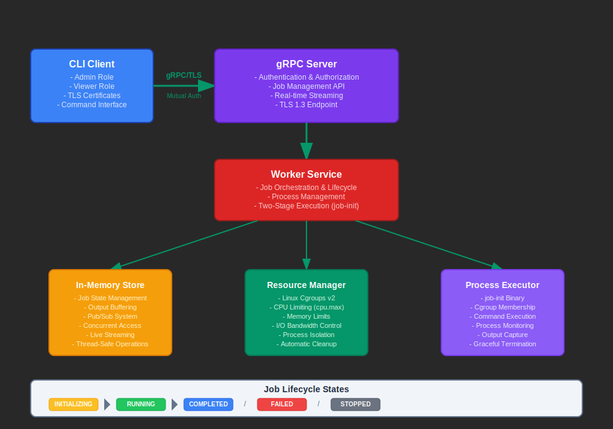

# Worker - Linux Process Isolation Platform

[](https://github.com/ehsaniara/job-worker/actions/workflows/ci.yml)
[](https://goreportcard.com/report/github.com/ehsaniara/job-worker)
[](https://golang.org/)
[](https://opensource.org/licenses/MIT)
[](https://github.com/ehsaniara/job-worker/releases/latest)


**Worker** is a secure job execution platform designed to **isolate system calls from clients**, providing safe remote
command execution on Linux systems. By creating complete process isolation barriers, Worker prevents clients from
directly accessing the host system while enabling controlled job execution with comprehensive resource management and
real-time monitoring.

A high-performance job isolation platform consisting of two main components:

- **Worker Daemon**: A Linux service that provides secure job execution with advanced resource management and namespace
  isolation
- **Worker CLI**: A command-line interface that allows users to interact with the daemon to manage jobs remotely

The platform provides secure execution of workloads with comprehensive monitoring capabilities and enterprise-grade
isolation.

## 🔍 System Call Isolation in Action

Here's a clear demonstration of how Worker isolates system calls and process visibility:

### **Without Worker: Direct Host Execution (Dangerous)**

```bash
# Running ps aux directly on the host shows ALL system processes
$ ps aux
USER         PID %CPU %MEM    VSZ   RSS TTY      STAT START   TIME COMMAND
root           1  0.0  0.3 167744 13132 ?        Ss   Jun26   0:11 /sbin/init
root           2  0.0  0.0      0     0 ?        S    Jun26   0:00 [kthreadd]
root           3  0.0  0.0      0     0 ?        I<   Jun26   0:00 [rcu_gp]
root           4  0.0  0.0      0     0 ?        I<   Jun26   0:00 [rcu_par_gp]
systemd+     564  0.0  0.2  90096  5392 ?        Ss   Jun26   0:00 /lib/systemd/systemd-resolved
messagebus   565  0.0  0.1   8808  3840 ?        Ss   Jun26   0:02 /usr/bin/dbus-daemon --system
root         567  0.0  0.4  30104  8448 ?        Ss   Jun26   0:00 /usr/bin/python3 /usr/bin/networkd
root         789  0.0  0.2  12172  6144 ?        Ss   Jun26   0:00 sshd: /usr/sbin/sshd -D
worker      1234  0.1  0.5 123456 10240 ?        Sl   Jun26   1:23 /opt/worker/worker
postgres    2345  0.0  1.2 456789 25600 ?        S    Jun26   0:45 postgres: main process
mysql       3456  0.2  2.1 789012 43520 ?        Sl   Jun26   2:10 mysqld --datadir=/var/lib/mysql
apache2     4567  0.0  0.8 234567 16384 ?        S    Jun26   0:30 /usr/sbin/apache2 -DFOREGROUND
...
user        9999  0.0  0.0  10072  1608 pts/2    R+   17:37   0:00 ps aux
```

**⚠️ Security Issues:**

- Process can see ALL system processes (including sensitive services)
- Has access to process details, PIDs, and resource usage
- Can potentially interact with or signal other processes
- No isolation from host system resources

### **With Worker: Isolated Job Execution (Secure)**

```bash
# Running the same command through Worker shows ONLY the job's process
$ worker-cli run ps aux
Job started:
ID: 120
Command: ps aux
Status: RUNNING
StartTime: 2025-06-30T17:34:33Z

$ worker-cli log 120   
USER         PID %CPU %MEM    VSZ   RSS TTY      STAT START   TIME COMMAND
0              1  0.0  0.0  10044  1580 ?        R    17:34   0:00 ps aux
```

**✅ Security Benefits:**

- Job sees ONLY its own process (PID 1 in isolated namespace)
- Cannot discover or interact with host processes
- Complete process isolation from host system
- Protected from interference by other jobs

### **File System Isolation Example**

**Without Worker (Host Access):**

```bash
$ ls /
bin   dev  home  lib64  mnt  proc  run   srv  tmp  var
boot  etc  lib   media  opt  root  sbin  sys  usr
```

**With Worker (Isolated Filesystem):**

```bash
$ worker-cli run ls /
bin  lib  lib64  proc  sys  tmp  usr  work

$ worker-cli run ls /proc
1  cpuinfo  meminfo  mounts  version

$ worker-cli run cat /proc/cpuinfo
# Shows limited CPU information for the isolated environment
```

**Key Isolation Features:**

- **Isolated Root Filesystem**: Each job gets its own `/` directory
- **Limited System Access**: Only essential directories are available
- **Private `/tmp`**: Each job has its own temporary space
- **Controlled `/proc`**: Process information is limited to the job's namespace
- **Read-only System Binaries**: Access to `/bin`, `/usr/bin`, etc. but cannot modify

### **Resource Limitation Example**

**Without Worker (Unrestricted):**

```bash
# This could consume all system memory and crash the host
$ python3 -c "
data = []
while True:
    data.append('x' * 1024 * 1024)  # Allocate 1MB chunks forever
    print(f'Allocated {len(data)} MB')
"
# Will eventually crash the entire system
```

**With Worker (Resource Protected):**

```bash
# Same command but with memory limit - safely contained
$ worker-cli run --max-memory=512 python3 -c "
data = []
while True:
    data.append('x' * 1024 * 1024)
    print(f'Allocated {len(data)} MB')
"

$ worker-cli log <job-id>
Allocated 1 MB
Allocated 2 MB
...
Allocated 500 MB
Allocated 512 MB
Killed  # Job terminated when it hit the 512MB limit
```

**Resource Protection:**

- **Memory Limits**: Jobs cannot exceed allocated memory
- **CPU Limits**: Prevents CPU starvation of host system
- **I/O Limits**: Controls disk bandwidth usage
- **Process Limits**: Restricts number of processes per job

## 🚀 Features

### **Two-Component Architecture**

- **Worker Daemon**: High-performance Linux service providing job execution platform
- **Worker CLI**: Cross-platform client for remote job management and monitoring
- **Secure Communication**: mTLS-based gRPC communication between CLI and daemon
- **Multi-Client Support**: Multiple CLI clients can connect to single daemon simultaneously

### **Advanced Job Isolation (Daemon)**

- **Namespace Isolation**: Complete PID, mount, IPC, UTS, and cgroup namespace isolation
- **Filesystem Isolation**: Full chroot-based filesystem isolation with per-job isolated root filesystem
- **Resource Isolation**: CPU, memory, and I/O bandwidth limiting using cgroups v2
- **Process Isolation**: Jobs run in isolated process groups with controlled privilege escalation
- **System Call Isolation**: Jobs cannot access host processes or sensitive system information

### **Resource Management (Daemon)**

- **CPU Limiting**: Precise CPU percentage allocation (e.g., 50% = half a CPU core)
- **Memory Control**: Hard and soft memory limits with OOM protection
- **I/O Throttling**: Disk I/O bandwidth limiting (bytes per second)
- **Process Limits**: Control maximum number of processes per job

### **User Experience (CLI)**

- **Intuitive Commands**: Simple and familiar command-line interface
- **Real-time Monitoring**: Live log streaming and job status updates
- **Remote Management**: Connect to daemon from anywhere with network access
- **Cross-Platform**: CLI runs on Linux, macOS, and Windows

### **Security & Authentication**

- **mTLS Authentication**: Certificate-based client authentication with role-based access
- **Admin/Viewer Roles**: Granular permissions (admin: full access, viewer: read-only)
- **Certificate Management**: Automated certificate generation and validation
- **Secure by Default**: All communication encrypted with TLS 1.3+

### **Enterprise Ready**

- **High Performance**: Daemon handles 100+ concurrent jobs with minimal overhead
- **Service Integration**: Full systemd integration with proper cgroup delegation
- **Configuration Management**: YAML-based config with environment variable overrides
- **Production Logging**: Comprehensive logging and monitoring capabilities
- **Scalable Design**: Support for multiple environments and daemon instances

## 📦 Installation

Worker consists of two main components that work together:

### 🔧 Component Overview

1. **Worker Daemon** (`worker`)
    - Runs as a Linux systemd service
    - Handles job execution, isolation, and resource management
    - Provides gRPC API with mTLS security
    - Installed at `/opt/worker/worker`

2. **Worker CLI** (`worker-cli`)
    - Command-line interface for interacting with the daemon
    - Can run on any machine (Linux, macOS, Windows)
    - Connects to daemon via secure gRPC
    - Installed as `/usr/bin/worker` (symlinked to `/opt/worker/worker-cli`)

### Quick Start (Debian/Ubuntu)

```bash
# Download the latest release
wget https://github.com/ehsaniara/worker/releases/latest/download/worker_1.0.0_amd64.deb

# Install the package (installs both daemon and CLI)
sudo dpkg -i worker_1.0.0_amd64.deb

# Start the daemon service
sudo systemctl start worker
sudo systemctl enable worker

# Verify daemon is running
sudo systemctl status worker

# Test CLI connection to daemon
worker-cli list
```

### Manual Installation

```bash
# Clone the repository
git clone https://github.com/ehsaniara/worker.git
cd worker

# Build both binaries
make build  # Creates: worker (daemon) and worker-cli

# Generate mTLS certificates
sudo ./scripts/certs_gen.sh

# Install daemon
sudo cp worker /opt/worker/
sudo cp config/config.yml /opt/worker/config/
sudo cp etc/worker.service /etc/systemd/system/

# Install CLI (with convenient symlink)
sudo cp worker-cli /opt/worker/
sudo ln -sf /opt/worker/worker-cli /usr/bin/worker

# Start daemon service
sudo systemctl daemon-reload
sudo systemctl enable worker
sudo systemctl start worker
```

### CLI-Only Installation (Remote Machines)

If you only need the CLI to connect to a remote Worker daemon:

```bash
# Download CLI binary only
wget https://github.com/ehsaniara/worker/releases/latest/download/worker-cli-linux-amd64

# Make executable and install
chmod +x worker-cli-linux-amd64
sudo mv worker-cli-linux-amd64 /usr/local/bin/worker

# Copy certificates from daemon server
scp server:/opt/worker/certs/ca-cert.pem ./certs/
scp server:/opt/worker/certs/client-cert.pem ./certs/
scp server:/opt/worker/certs/client-key.pem ./certs/

# Connect to remote daemon
worker --server=your-daemon-server:50051 list
```

## 🔧 Configuration

Worker uses a hierarchical configuration system: **Environment Variables** > **Config File** > **Defaults**

### Example Configuration (`/opt/worker/config/config.yml`)

```yaml
server:
  address: "0.0.0.0"
  port: 50051
  mode: "server"

worker:
  defaultCpuLimit: 100          # 100% CPU (1 full core)
  defaultMemoryLimit: 512       # 512MB memory limit
  defaultIoLimit: 10485760      # 10MB/s I/O limit
  maxConcurrentJobs: 50         # Maximum concurrent jobs
  jobTimeout: "1h"              # Job execution timeout
  validateCommands: true        # Enable command validation

security:
  serverCertPath: "/opt/worker/certs/server-cert.pem"
  serverKeyPath: "/opt/worker/certs/server-key.pem"
  caCertPath: "/opt/worker/certs/ca-cert.pem"
  minTlsVersion: "1.3"

cgroup:
  baseDir: "/sys/fs/cgroup/worker.slice/worker.service"
  enableControllers: [ "cpu", "memory", "io", "pids" ]
  cleanupTimeout: "5s"

filesystem:
  baseDir: "/opt/worker/jobs"        # Base directory for isolated job filesystems
  tmpDir: "/tmp/job-{JOB_ID}"       # Job-specific tmp directory template
  allowedMounts: # Read-only system directories mounted in isolated filesystems
    - "/usr/bin"
    - "/bin"
    - "/lib"
    - "/lib64"
    - "/usr/lib"
    - "/usr/lib64"
  blockDevices: false               # Block access to devices

logging:
  level: "INFO"
  format: "text"
  output: "stdout"
```

### Environment Variables

```bash
# Server configuration
export WORKER_SERVER_ADDRESS="0.0.0.0"
export WORKER_SERVER_PORT="50051"

# Resource defaults
export WORKER_DEFAULT_CPU="100"
export WORKER_DEFAULT_MEMORY="512"
export WORKER_MAX_CONCURRENT_JOBS="50"

# Security
export WORKER_MIN_TLS_VERSION="1.3"

# Logging
export LOG_LEVEL="INFO"
```

## 💻 Usage

### Worker Daemon (Service Management)

The Worker daemon runs as a systemd service and provides the core job execution platform:

```bash
# Service management
sudo systemctl start worker       # Start the daemon
sudo systemctl stop worker        # Stop the daemon  
sudo systemctl restart worker     # Restart the daemon
sudo systemctl status worker      # Check daemon status
sudo systemctl enable worker      # Enable auto-start on boot

# View daemon logs
sudo journalctl -u worker -f      # Follow live logs
sudo journalctl -u worker --since="1 hour ago"  # Recent logs

# Check daemon health
curl -k https://localhost:50051   # Basic connectivity test
```

### Worker CLI (Job Management)

The Worker CLI connects to the daemon to manage jobs. It can run locally or remotely:

#### Basic Job Operations

```bash
# Run a simple command
worker-cli run echo "Hello, World!"

# Run with resource limits
worker-cli run --max-cpu=50 --max-memory=256 python3 script.py

# Run with I/O limits  
worker-cli run --max-iobps=5242880 dd if=/dev/zero of=/tmp/test bs=1M count=100

# Complex commands with arguments
worker-cli run bash -c "curl -s https://api.github.com/users/octocat | jq '.name'"
```

#### Job Monitoring & Control

```bash
# List all jobs
worker-cli list

# Get detailed job status
worker-cli status <job-id>

# Stream live logs (follows job output in real-time)
worker-cli log <job-id>

# Stop a running job gracefully
worker-cli stop <job-id>
```

#### Remote Daemon Connection

```bash
# Connect to remote daemon
worker-cli --server=192.168.1.100:50051 list
worker-cli --server=production-server:50051 run python3 script.py

# Set default server in environment
export WORKER_SERVER=192.168.1.100:50051
worker-cli list  # Now uses remote server by default
```

#### Advanced Usage Examples

```bash
# Long-running background process with monitoring
worker-cli run --max-cpu=100 --max-memory=1024 python3 long_process.py
JOB_ID=$(worker-cli list | tail -1 | awk '{print $1}')
worker-cli log $JOB_ID  # Stream logs in separate terminal

# Batch job processing
for file in *.py; do
    worker-cli run --max-memory=512 python3 "$file"
done

# Resource-constrained testing
worker-cli run --max-cpu=25 --max-memory=128 npm test
worker-cli run --max-cpu=50 --max-memory=256 go test ./...
```

### CLI Configuration

```bash
# Default CLI configuration
worker-cli --help

# Available flags:
#   --server, -s     Server address (default: "192.168.1.161:50051")
#   --help, -h       Show help

# Environment variables:
export WORKER_SERVER="your-daemon:50051"  # Default server
export WORKER_CLIENT_CERT="/path/to/client-cert.pem"
export WORKER_CLIENT_KEY="/path/to/client-key.pem" 
export WORKER_CA_CERT="/path/to/ca-cert.pem"
```

### API Examples (gRPC)

```go
// Connect to Worker service
conn, err := grpc.Dial("localhost:50051", grpc.WithTransportCredentials(creds))
client := pb.NewJobServiceClient(conn)

// Run a job
job := &pb.RunJobReq{
Command:   "python3",
Args:      []string{"script.py", "--input", "data.txt"},
MaxCPU:    50,  // 50% CPU limit
MaxMemory: 256, // 256MB memory limit
MaxIOBPS:  1048576, // 1MB/s I/O limit
}

response, err := client.RunJob(ctx, job)
fmt.Printf("Job started: %s\n", response.Id)

// Get job status
status, err := client.GetJobStatus(ctx, &pb.GetJobStatusReq{Id: response.Id})
fmt.Printf("Status: %s, Exit Code: %d\n", status.Status, status.ExitCode)

// Stream logs
stream, err := client.GetJobLogs(ctx, &pb.GetJobLogsReq{Id: response.Id})
for {
chunk, err := stream.Recv()
if err == io.EOF { break }
fmt.Print(string(chunk.Payload))
}
```

## 🏗️ Architecture



### Component Communication

#### Daemon Architecture

- **Single Binary Design**: The `worker` binary auto-detects execution mode (server/init)
- **Systemd Integration**: Full systemd service integration with proper cgroup delegation
- **Namespace Management**: Deep Linux namespace integration for complete isolation
- **Resource Enforcement**: Hardware-level resource limiting via cgroups v2
- **State Management**: In-memory job state with real-time event streaming

#### CLI Architecture

- **Lightweight Client**: Minimal footprint gRPC client
- **Cross-Platform**: Runs on Linux, macOS, and Windows
- **Secure Communication**: mTLS with certificate-based authentication
- **Real-time Streaming**: Live log streaming and job status updates

### Key Design Principles

1. **Separation of Concerns**: Daemon handles execution, CLI handles user interaction
2. **Security First**: All communication secured with mTLS and role-based access
3. **Platform Agnostic CLI**: CLI can run anywhere, daemon optimized for Linux
4. **Scalable Architecture**: Support for multiple remote CLI clients per daemon
5. **Enterprise Ready**: Production-grade logging, monitoring, and error handling

## 🔒 Security Model

### Authentication & Authorization

Worker implements a comprehensive security model:

```bash
# Certificate-based roles
- Admin Role (OU=admin): Full access to all operations
- Viewer Role (OU=viewer): Read-only access to jobs and logs

# mTLS Configuration
- TLS 1.3 minimum version
- Certificate-based client authentication
- Role-based operation authorization
```

### Isolation Guarantees

- **Process Isolation**: Jobs cannot see or interact with host processes
- **Filesystem Isolation**: Jobs operate in isolated chroot environments
- **Resource Isolation**: Hardware resource limits prevent resource exhaustion
- **Network Isolation**: Optional network namespace isolation
- **Privilege Isolation**: Jobs run with minimal required privileges

## 🎯 Use Cases

### **Development & Testing**

```bash
# Run test suites in isolation on daemon server from developer workstation
worker-cli --server=dev-server:50051 run --max-memory=1024 pytest tests/

# Execute build scripts with resource limits
worker-cli run --max-cpu=200 make build

# Run security scans remotely
worker-cli --server=security-server:50051 run --max-iobps=10485760 trivy scan .
```

### **CI/CD Integration**

```bash
# CI agents connecting to dedicated worker daemon
export WORKER_SERVER=build-server:50051

# Isolated build environments
worker-cli run --max-memory=2048 docker build -t myapp .

# Parallel test execution across multiple CI agents
worker-cli run --max-cpu=50 npm test
worker-cli run --max-cpu=50 go test ./...

# Deploy from CI to production worker daemon
worker-cli --server=prod-worker:50051 run kubectl apply -f deployment.yaml
```

### **Remote Development**

```bash
# Local CLI connecting to powerful remote development server
export WORKER_SERVER=dev-box.company.com:50051

# Run resource-intensive tasks on remote server
worker-cli run --max-memory=8192 cargo build --release
worker-cli run --max-cpu=400 python3 train_model.py

# Debug remotely with live log streaming
worker-cli run python3 debug_script.py &
JOB_ID=$!
worker-cli log $JOB_ID  # Stream logs locally while job runs remotely
```

### **Data Processing & Analytics**

```bash
# Analytics team CLI connecting to data processing server
worker-cli --server=analytics-server:50051 run --max-memory=4096 python process_data.py large_dataset.csv

# ETL pipelines with I/O throttling
worker-cli run --max-iobps=52428800 spark-submit etl_job.py

# Batch processing across multiple worker daemons
for server in worker-1 worker-2 worker-3; do
    worker-cli --server=$server:50051 run python3 batch_job.py &
done
```

### **Security & Compliance**

```bash
# Security team running sandboxed analysis on dedicated server
worker-cli --server=sandbox-server:50051 run --max-cpu=25 --max-memory=128 analyze_malware.sh

# Compliance testing with resource monitoring
worker-cli --server=compliance-server:50051 run --max-memory=512 compliance_check.py

# Isolated penetration testing
worker-cli --server=pentest-server:50051 run nmap -sS target_network
```

### **Multi-Environment Management**

```bash
# Different environments with different worker daemons
export DEV_WORKER=dev.company.com:50051
export STAGE_WORKER=staging.company.com:50051  
export PROD_WORKER=prod.company.com:50051

# Deploy to different environments
worker-cli --server=$DEV_WORKER run deploy.sh dev
worker-cli --server=$STAGE_WORKER run deploy.sh staging  
worker-cli --server=$PROD_WORKER run deploy.sh production

# Monitor across environments
worker-cli --server=$DEV_WORKER list
worker-cli --server=$STAGE_WORKER list
worker-cli --server=$PROD_WORKER list
```

## 📊 Performance & Monitoring

### Resource Monitoring

```bash
# Real-time job monitoring
worker status <job-id>

# Resource usage tracking
worker log <job-id> | grep "resource"

# System-wide monitoring
sudo systemctl status worker
journalctl -u worker -f
```

### Performance Characteristics

- **Startup Time**: < 100ms for job initialization
- **Memory Overhead**: ~10MB per job + job memory limit
- **CPU Overhead**: < 1% for isolation and monitoring
- **Throughput**: 100+ concurrent jobs on standard hardware
- **Scalability**: Linear scaling with available system resources

## 🛠️ Development

### Building from Source

```bash
# Install dependencies
go mod download

# Generate protobuf code
make proto

# Build binaries
make build

# Run tests
make test

# Build Debian package
make package
```

### Contributing

1. Fork the repository
2. Create a feature branch (`git checkout -b feature/amazing-feature`)
3. Commit your changes (`git commit -m 'Add amazing feature'`)
4. Push to the branch (`git push origin feature/amazing-feature`)
5. Open a Pull Request

### 📋 System Requirements

#### Worker Daemon (Production)

- **OS**: Linux kernel 4.6+ (cgroup v2 support required)
- **Architecture**: x86_64, ARM64
- **Memory**: 1GB+ RAM (2GB+ recommended for multiple concurrent jobs)
- **Disk**: 10GB+ available space for job execution and logs
- **Privileges**: Root access required for namespace operations and cgroup management
- **Network**: Port 50051 available for gRPC API (configurable)

#### Worker CLI (Client)

- **OS**: Linux, macOS 10.15+, Windows 10+
- **Architecture**: x86_64, ARM64 (macOS), x86_64 (Windows)
- **Memory**: 50MB+ RAM (minimal footprint)
- **Network**: Network access to daemon server on port 50051
- **Certificates**: Client certificates for mTLS authentication

#### Network Requirements

- **Daemon**: Listens on configurable port (default: 50051)
- **Firewall**: Allow inbound connections on daemon port from CLI clients
- **TLS**: Certificate files must be accessible to both daemon and CLI
- **DNS**: Hostname resolution for remote connections (or use IP addresses)

## 🤝 Support & Documentation

### Getting Help

- **GitHub Issues**: [Report bugs and request features](https://github.com/ehsaniara/worker/issues)
- **Discussions**: [Community discussions and Q&A](https://github.com/ehsaniara/worker/discussions)
- **Documentation**: Full documentation in the `/docs` directory
- **Examples**: Sample configurations and use cases in `/examples`

### Troubleshooting

#### Daemon Issues

```bash
# Check daemon status
sudo systemctl status worker

# View daemon logs
sudo journalctl -u worker -f

# Test daemon connectivity
curl -k https://localhost:50051

# Verify certificates
openssl verify -CAfile /opt/worker/certs/ca-cert.pem /opt/worker/certs/server-cert.pem
```

#### CLI Connection Issues

```bash
# Test CLI connectivity
worker-cli --server=daemon-host:50051 list

# Check certificate paths
ls -la ./certs/ca-cert.pem ./certs/client-cert.pem ./certs/client-key.pem

# Verify certificate details
openssl x509 -in ./certs/client-cert.pem -noout -subject
```

#### Common Solutions

- **Connection refused**: Check if daemon is running and port 50051 is accessible
- **Certificate errors**: Ensure client certificates are valid and accessible
- **Permission denied**: Verify client certificate has appropriate role (admin/viewer)
- **Job failures**: Check resource limits and available system resources

### License

This project is licensed under the MIT License - see the [LICENSE](LICENSE) file for details.

### Contributing

We welcome contributions! Please see our [Contributing Guide](CONTRIBUTING.md) for details on:

- Setting up development environment
- Running tests
- Submitting pull requests
- Code style guidelines

### Changelog

See [CHANGELOG.md](CHANGELOG.md) for a list of changes and version history.
