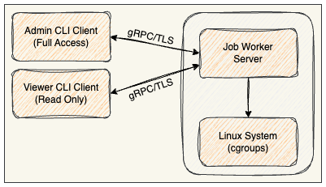
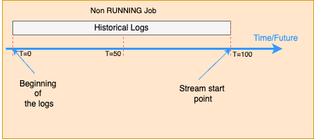

# Job Worker Application Design Document


## Summary

The Job Worker Service is a gRPC-based system for executing and managing system processes with resource constraints
using Linux cgroups. It provides secure, isolated execution of commands with CPU, memory, and I/O limitations, featuring
real-time log streaming and comprehensive job lifecycle management.

### Core

* **Resource Isolation:** Leverage Linux cgroups v2 for strict resource enforcement
* **Real-time Monitoring:** Provide live log streaming and status updates via gRPC streams
* **Security-First:** Implement mTLS authentication with role-based access control
* **Graceful Degradation:** Continue operation even if some resource controls fail
* **Pub/Sub Architecture:** Decouple log collection from distribution using publisher-subscriber pattern

## System Architecture

### High-Level Architecture



## Design Approach

## Scope

### In Scope

* **Job Management:** Create, start, stop, list, and monitor jobs
* **Resource Control:** CPU, memory, and I/O bandwidth limiting via cgroups
* **Real-time Logging:** Live stdout/stderr streaming to multiple subscribers
* **Security:** Mutual TLS with certificate-based role authorization
* **CLI Interface:** Command-line client
* **Process Groups:** Proper cleanup of child processes

### Out of Scope

* Job scheduling/queuing (single worker model)
* Persistent storage (in-memory only)
* Multi-node deployment

## Edge Cases Handled

* **Orphaned Processes:** Process groups ensure all children are terminated
* **Cgroup Failures:** Continue execution with logging warnings
* **Stream Subscribers:** Auto-cleanup of stalled/slow subscribers (5s timeout)
* **Resource Cleanup:** Async cgroup cleanup with timeout protection
* **Graceful Shutdown:** Signal handling for clean server termination
* **Certificate Validation:** Organization Unite

## API Design

### gRPC Service Definition

```protobuf
syntax = "proto3";

service JobService{
  rpc CreateJob(CreateJobReq) returns (CreateJobRes){}            // Admin only
  rpc GetJob(GetJobReq) returns (GetJobRes){}                     // Admin + Viewer
  rpc StopJob(StopJobReq) returns (StopJobRes){}                  // Admin only
  rpc GetJobsStream(GetJobsStreamReq) returns (stream DataChunk); // Admin + Viewer
}

// CreateJob
message CreateJobReq{
  string command = 1;
  repeated string args = 2;
  int32 maxCPU = 3;
  int32 maxMemory = 4;
  int32 maxIOBPS = 5;
}

message CreateJobRes{
  string id = 1;
  string command = 2;
  repeated string args = 3;
  int32 maxCPU = 4;
  int32 maxMemory = 5;
  int32 maxIOBPS = 6;
  string status = 7;
  string startTime = 8;
  string endTime = 9;
  int32 exitCode = 10;
}

// GetJob
message GetJobReq{
  string id = 1;
}

message GetJobRes{
  string id = 1;
  string command = 2;
  repeated string args = 3;
  int32 maxCPU = 4;
  int32 maxMemory = 5;
  int32 maxIOBPS = 6;
  string status = 7;
  string startTime = 8;
  string endTime = 9;
  int32 exitCode = 10;
}

// StopJob
message StopJobReq{
  string id = 1;
}

message StopJobRes{
  string id = 1;
  string status = 2;
  string endTime = 3;
  int32 exitCode = 4;
}

// GetJobsStream
message GetJobsStreamReq{
  string id = 1;
}

message DataChunk {
  bytes payload = 1;
}

```

### Default Resource Limits

* **CPU:** `10%` of one core
* **Memory:** `1MB`
* **I/O:** Unlimited (`0`)

### Authorization Chart

| Operation  | Admin Role | Viewer Role | Description                         |
|------------|------------|-------------|-------------------------------------|
| CreateJob  | ALLOW      | DENY        | Start new jobs with resource limits |
| GetJob     | ALLOW      | ALLOW       | Retrieve job details and status     |
| StopJob    | ALLOW      | DENY        | Terminate running jobs              |
| StreamLogs | ALLOW      | ALLOW       | Real-time log streaming             |

## Security Architecture

### Certificate-Based Role Management

#### Role Types and Detection

- **Admin Role**: Full system access with job management capabilities
    - **Detection Methods**:
        - `OU=Admin` in certificate subject
    - **Permissions**: All operations (CRUD + streaming)

- **Viewer Role**: Read-only access for monitoring
    - **Detection Methods**:
        - `OU=Viewer` in certificate subject
    - **Permissions**: Get, List, Stream operations only

#### Certificate Infrastructure

#### TLS Configuration

- **Version**: TLS 1.3 minimum
- **Authentication**: Mutual TLS with mandatory client certificates
- **Key Strengths**: `4096-bit` CA, `2048-bit` clients keys (admin/viewer)
- **Certificate Lifetime**: `365` days with renewal processes

### Authorization Flow


## Data Flow Architecture

### Job Lifecycle


- Create cgroups first
- Start process, using `cmd.Start()`
- IMMEDIATELY suspend the process before it can do anything, using`syscall.SIGSTOP`
  - **Note: Tiny race windows:** Process can execute a few CPU instructions before `SIGSTOP` arrives
- Add suspended process to cgroup
- Resume process that it's safely in cgroup, using`syscall.SIGCONT`

### Real-Time Log Streaming


**Pub-Sub Implementation Details**:

The system implements an in-memory pub-sub mechanism without external message brokers:

1. **Task-Level Subscribers**: Each Task (Task: is a wrapper around the job) maintains its own subscriber list

2. **Subscription Management**:
    - **Subscribe**: Creates small buffered channel (`2` messages), adds to subscriber list
    - **Unsubscribe**: Removes channel from list, closes channel safely
    - **Auto-cleanup**: Detects stalled subscribers (`50ms` timeout), removes automatically
    - **Context-based cleanup**: Subscribers auto-removed when task context is cancelled

3. **Message Flow**:
    - Process Output -> `WriteToBuffer` -> `Publish(Update)` -> Subscriber Channels
    - **Update:** Contains the:
        - JobId
        - LogChunk `[]byte`
        - Status

4. **Delivery Guarantees**:
    - **Best Effort**: Non-blocking sends with timeout
    - **Small Buffer**: Each subscriber has `2` message buffer for immediate delivery
    - **Cleanup**: Slow/dead subscribers automatically removed
    - **Multiple Subscribers**: Same log chunk delivered to all active subscribers
    - **Output Persistence**: All job outputs permanently stored in task buffer regardless of subscribers

5. **Thread Safety**:
    - Copy-on-read pattern for subscriber list during publishing
    - Mutex-protected subscriber management with race condition prevention
    - Safe channel cleanup to prevent double-close panics

6. **Performance Characteristics**:
    - **Memory**: Bounded by `2N` buffered messages where N is subscriber count
    - **Latency**: Near real-time delivery with `50ms` timeout protection
    - **Throughput**: Limited by slowest subscriber (with aggressive timeout protection)
    - **Scalability**: O(n) delivery cost
        - `n` is subscriber count per job
    - **Memory Efficiency**: Optimized for multiple subscribers per job
7. **Buffer sizing Example**
   ```text
    Job outputs: [Log A] [Log B] [Log C] ...
    Subscriber processing time: 30ms per message
    Publisher timeout: 50ms

    Timeline with buffer=2:
    t=0ms:   Log A arrives -> buffer [A]
    t=20ms:  Log B arrives -> buffer [A,B]
    t=30ms:  Subscriber processes A -> buffer [B]
    t=40ms:  Log C arrives -> buffer [B,C]
    t=60ms:  Subscriber processes B -> buffer [C]
    Result: Subscriber keeps up, no timeouts
    
    Timeline with buffer=1:
    t=0ms:   Log A arrives -> buffer [A]
    t=20ms:  Log B arrives -> buffer full -> 50ms timeout -> subscriber DROPPED
    Result: Subscriber removed due to buffer overflow
    ```
#### Real-Time Log Streaming (Running)


- Client start the stream
- First retrieve existing logs (Historical)
- Subscribe to job's log (If job is RUNNING)
- Stream the logs to client as logs are showing up to channel
- End the stream when status is not RUNNING

#### Real-Time Log Streaming (Non-Running)



- Client start the stream
- Retrieve existing logs (Historical)
- Subscribe to job's log
- End the stream since job not RUNNING

## Resource Management

### Linux Cgroups v2 Integration

#### CPU Management

- **Control File**: `cpu.max`
- **Format**: `<microseconds> <period>` (e.g., "50000 100000" = 50%)
- **Fallback**: `cpu.weight` for alternative implementations
- **Default Limit**: 10% of one CPU core

#### Memory Management

- **Hard Limit**: `memory.max` (absolute ceiling)
- **Soft Limit**: `memory.high` (90% of max for early warnings)
- **Units**: Bytes (converted from MB input)
- **Default Limit**: 1MB

#### I/O Management

- **Control File**: `io.max`
- **Multiple Format Support**: Device-specific bandwidth limits
- **Strategies**: Multiple format attempts for device compatibility
- **Default**: Unlimited (0 value)

### Process Isolation

- **Process Groups**: Each job runs in dedicated process group
- **Child Process Handling**: Negative PID kills for complete cleanup
- **Signal escalation**: `SIGTERM` -> `SIGKILL` for graceful/forced termination
- **Resource Enforcement**: Cgroup limits prevent resource abuse

## Performance and Scalability

### Concurrent Operations

- **Thread Safety**: Mutex-protected data structures throughout

### Resource Limits and Safeguards

- **gRPC Message Sizes**: `512KB` receive, `4MB` send limits
- **Header Size Limits**: `1MB` maximum header list size
- **Timeout Management**: `5` second subscriber timeout for stalled clients
- **Memory Management**: Bounded log buffers prevent unbounded growth

### Monitoring and Observability

- **Comprehensive Logging**: `INFO`, `WARN`, `ERROR`, `DEBUG` levels
- **Operation Logging**: All authorization decisions logged
- **Performance Metrics**: Job timing, resource usage tracking

## CLI Design and Usage

### Command Structure

```text
Commands:
  create  Create and start a new job (Admin only)
  get     Get detailed job information by ID
  list    List all jobs with basic information  
  stop    Stop a running job by ID (Admin only)
  stream  Stream real-time job logs by ID
```

#### Operations

```bash
  ./cli get 12345                 
  ./cli stream 12345
  ./cli stop 12345
  
  ./cli create ping -c 5 google.com  
  ./cli create ls -la /tmp
  ./cli create bash -c "for i in {1..10}; do echo \$i; done"
  
  ./cli create /bin/sh -c "echo 'POSIX shell'"
```

#### with resource limit

```bash
  ./cli create --max-memory=1024 --max-cpu=25 ping -c 100 google.com
```

## Deployment Architecture

### System Requirements

- **Application Base Directory**: `/opt/job-worker`
- **Operating System**: Linux with cgroups v2 support
- **Privileges**: Root access required for cgroup management
- **Network**: TCP port `50051` accessible for gRPC communications
- **Storage**: `/opt/job-worker/certs/` directory for certificates
- **Dependencies**: OpenSSL for certificate operations

### Certificate Deployment Strategy

1. **Server Setup**: Generate CA and server certificates on target machine
2. **Client Distribution**: Securely distribute role-specific client certificates
3. **Permission Management**: Proper file permissions (`600` for keys, `644` for certs)
4. **Role Assignment**: Map organizational roles to certificate types

### Configuration Management

- **Cgroup Base Directory**: `/sys/fs/cgroup/job-worker/`
- **Certificate Directory**: `/opt/job-worker/certs/`

## Current Limitations

- **In-Memory Storage**: No persistence across server restarts
- **Single Node Operation**: No distributed execution capabilities
- **Static Role Assignment**: Certificate-based roles cannot be changed at runtime
- **Limited Resource Monitoring**: No real-time resource usage metrics

## Future Enhancements

### Potential Improvements

* **Persistent Storage:** Database backend for job history
* **Job Queuing / Scheduling:** Multi-job scheduling and prioritization
* **Metrics Collection:** Prometheus/OpenTelemetry integration
* **Web Dashboard:** HTTP interface for job management
* **Resource Monitoring:** Real-time resource usage tracking
