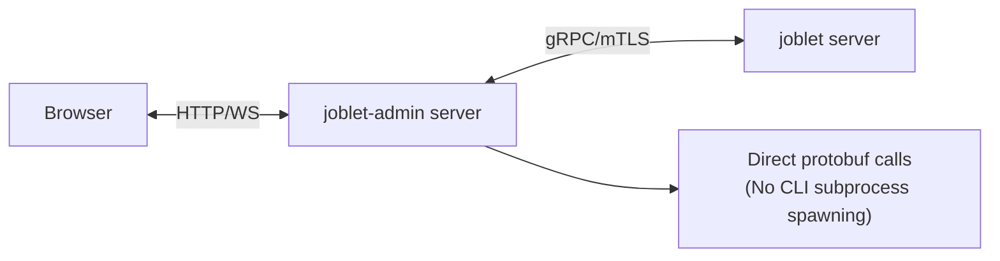

# Design Document: Admin UI Extraction and Migration

## Executive Summary

This document outlines the architectural migration plan to extract the admin UI from the RNX CLI into a standalone
`joblet-admin` package. This separation will improve maintainability, performance, and user experience while
establishing clearer architectural boundaries.

## 1. Current State Architecture

### 1.1 Existing Structure

```text
joblet/
├── cmd/rnx/              # Go CLI including admin command
├── admin/
│   ├── server/           # Node.js Express server
│   └── ui/               # React frontend
└── internal/rnx/         # Go implementation
```

### 1.2 Current Problems

**Architectural Issues:**

- CLI tool (RNX) requires Node.js solely for admin UI functionality
- Admin server uses inefficient subprocess spawning to execute RNX commands
- Tight coupling between CLI and web UI codebases
- Complex distribution logic in Homebrew formula to handle Node.js

**Performance Issues:**

- Each admin API call spawns a new RNX process
- No connection pooling or gRPC stream reuse
- Unnecessary serialization/deserialization through CLI layer
- Higher latency and resource consumption

**User Experience Issues:**

- Complicated installation process
- Unexpected Node.js requirement for CLI tool
- Cannot update admin UI independently of CLI
- Difficult to containerize admin UI

## 2. Proposed Architecture

### 2.1 Target Structure

```text
Separate Repositories/Packages:

joblet/                   # Main repository
└── cmd/rnx/             # Pure Go CLI (no admin command)

joblet-admin/            # New repository
├── src/grpc/            # Direct gRPC client
├── src/server/          # Express + WebSocket
├── src/ui/              # React frontend
└── package.json         # Standalone npm package
```

### 2.2 Component Interaction



### 2.3 Design Decisions

**Decision 1: No Separate Node.js SDK**

- Rationale: YAGNI principle - admin UI is the only Node.js consumer
- gRPC client code lives within joblet-admin package
- Can be extracted later if needed

**Decision 2: Reuse RNX Config Format**

- Maintains compatibility with existing setups
- Users can share same `~/.rnx/rnx-config.yml`
- Reduces migration friction

**Decision 3: Direct Protobuf Integration**

- Eliminates CLI subprocess overhead
- Better error handling and type safety
- Enables connection pooling and stream reuse

## 3. Migration Strategy

### 3.1 Phase 1: Preparation (Week 1-2)

**Objectives:**

- Set up new repository/package structure
- Generate TypeScript protobuf bindings
- Create development environment

**Activities:**

1. Create joblet-admin repository
2. Set up TypeScript build pipeline
3. Configure protobuf code generation
4. Establish testing framework

**Success Criteria:**

- Repository initialized with CI/CD
- Protobuf types successfully generated
- Basic project structure in place

### 3.2 Phase 2: gRPC Implementation (Week 3-4)

**Objectives:**

- Implement direct gRPC client
- Add mTLS authentication
- Create service wrappers

**Activities:**

1. Implement gRPC connection management
2. Add certificate loading from rnx-config.yml
3. Create service methods for all required operations
4. Implement streaming for logs and metrics

**Success Criteria:**

- Can connect to joblet server directly
- All required gRPC methods implemented
- Streaming operations working

### 3.3 Phase 3: Server Migration (Week 5-6)

**Objectives:**

- Replace CLI spawning with gRPC calls
- Migrate Express server code
- Maintain API compatibility

**Activities:**

1. Port server code to new repository
2. Replace subprocess.exec with gRPC client calls
3. Update WebSocket handlers for streaming
4. Implement error handling and retries

**Success Criteria:**

- All API endpoints working with gRPC
- Performance improvement measurable
- No breaking changes to API contract

### 3.4 Phase 4: UI Migration (Week 7)

**Objectives:**

- Move React UI to new package
- Update build process
- Ensure seamless integration

**Activities:**

1. Copy UI code to new repository
2. Update import paths and dependencies
3. Test all UI functionality
4. Update build and bundle process

**Success Criteria:**

- UI fully functional in new package
- Build process optimized
- No regression in features

### 3.5 Phase 5: RNX Cleanup (Week 8)

**Objectives:**

- Remove admin functionality from RNX
- Simplify build process
- Update documentation

**Activities:**

1. Remove `rnx admin` command
2. Delete admin-related code
3. Update Homebrew formula
4. Simplify release process

**Success Criteria:**

- RNX is pure Go binary
- No Node.js dependencies
- Smaller binary size

### 3.6 Phase 6: Release & Documentation (Week 9)

**Objectives:**

- Publish joblet-admin to npm
- Update all documentation
- Communicate changes to users

**Activities:**

1. Publish npm package
2. Update installation guides
3. Create migration guide for users
4. Update README files
5. Announce deprecation of `rnx admin`

## 4. Technical Specifications

### 4.1 Package Structure

**joblet-admin Package:**

- Name: `@joblet/admin` or `joblet-admin`
- Entry point: `bin/joblet-admin`
- Dependencies: Express, gRPC, protobufjs, React
- Node version: >=18.0.0

### 4.2 Configuration

**Config File Compatibility:**

- Location: `~/.rnx/rnx-config.yml`
- Format: Unchanged from current
- Multi-node support maintained

**Environment Variables:**

```ini
JOBLET_ADMIN_PORT=5173
JOBLET_ADMIN_HOST=localhost
JOBLET_CONFIG_PATH=~/.rnx/rnx-config.yml
JOBLET_NODE=default
```

### 4.3 API Compatibility

**REST Endpoints:** Maintain current API structure

- `/api/jobs/*`
- `/api/volumes/*`
- `/api/networks/*`
- `/api/monitoring/*`
- `/api/runtimes/*`

**WebSocket Events:** Preserve existing event names

- `job:logs:stream`
- `monitoring:metrics`
- `job:status:update`

## 5. Performance Targets

### 5.1 Metrics

**Current Performance (with CLI spawning):**

- Job list latency: ~200-300ms
- Log streaming delay: ~100ms
- Connection overhead: New process per request

**Target Performance (with direct gRPC):**

- Job list latency: <50ms
- Log streaming delay: <10ms
- Connection overhead: Pooled connections

### 5.2 Resource Usage

**Expected Improvements:**

- 70% reduction in CPU usage
- 50% reduction in memory usage
- Eliminated process spawning overhead

## 6. Risk Analysis

### 6.1 Technical Risks

| Risk                          | Impact | Probability | Mitigation                          |
|-------------------------------|--------|-------------|-------------------------------------|
| Protobuf compatibility issues | High   | Low         | Extensive testing, version pinning  |
| gRPC streaming complexity     | Medium | Medium      | Reference Python SDK implementation |
| Config format changes         | High   | Low         | Maintain backward compatibility     |
| npm package conflicts         | Low    | Low         | Proper namespace (@joblet/admin)    |

### 6.2 User Impact Risks

| Risk                        | Impact | Probability | Mitigation                                |
|-----------------------------|--------|-------------|-------------------------------------------|
| Breaking existing workflows | High   | Medium      | Deprecation period, clear migration guide |
| Installation confusion      | Medium | High        | Comprehensive documentation               |
| Feature parity gaps         | High   | Low         | Thorough testing before release           |

## 7. Testing Strategy

### 7.1 Test Coverage

**Unit Tests:**

- gRPC client methods
- Service layer logic
- Configuration parsing

**Integration Tests:**

- End-to-end API testing
- gRPC connection handling
- Streaming operations

**UI Tests:**

- Component testing
- User flow testing
- Visual regression testing

### 7.2 Performance Testing

- Load testing with concurrent requests
- Streaming performance benchmarks
- Resource usage monitoring
- Comparison with current implementation

## 8. Rollout Plan

### 8.1 Release Strategy

**Alpha Phase (Week 9-10):**

- Internal testing
- Early adopter feedback
- Performance validation

**Beta Phase (Week 11-12):**

- Public beta release
- Gather user feedback
- Bug fixes and optimizations

**GA Release (Week 13):**

- Stable release to npm
- Deprecate `rnx admin` command
- Full documentation available

### 8.2 Communication Plan

**Announcement Channels:**

- GitHub release notes
- README updates
- Discord/Slack community
- Email to known users

**Documentation Updates:**

- Installation guides
- Migration instructions
- FAQ section
- Video tutorials

## 9. Success Metrics

### 9.1 Technical Metrics

- ✓ 70% reduction in API latency
- ✓ Zero subprocess spawning
- ✓ 50% reduction in memory usage
- ✓ Successful npm package deployment

### 9.2 User Metrics

- ✓ Simplified installation process
- ✓ Positive user feedback
- ✓ Reduced support tickets
- ✓ Increased admin UI adoption

## 10. Future Considerations

### 10.1 Potential Enhancements

**Short Term (3-6 months):**

- Docker image for joblet-admin
- Kubernetes deployment manifests
- Authentication layer for multi-user setup

**Medium Term (6-12 months):**

- Electron desktop application
- Progressive Web App (PWA) capabilities
- Plugin system for custom extensions

**Long Term (12+ months):**

- Hosted SaaS version
- Multi-cluster management
- Advanced RBAC implementation

### 10.2 Extensibility Options

- Extract gRPC client as joblet-sdk-node if needed
- Support for custom UI themes
- API webhook integrations
- Metrics export to Prometheus/Grafana

## 11. Decision Log

| Date | Decision                    | Rationale                      |
|------|-----------------------------|--------------------------------|
| TBD  | No separate Node.js SDK     | YAGNI - Admin is only consumer |
| TBD  | Reuse rnx-config format     | Minimize migration friction    |
| TBD  | Direct protobuf integration | Better performance             |
| TBD  | Standalone npm package      | Simpler distribution           |

## 12. Appendices

### A. Current Admin UI Features

- Job management (list, run, stop, delete)
- Log streaming and viewing
- System monitoring dashboards
- Volume management
- Network configuration
- Runtime management

### B. Dependencies to Migrate

- Express.js for server
- React for frontend
- WebSocket for real-time updates
- Various UI libraries (Recharts, Tailwind, etc.)

### C. Config File Example

```yaml
version: "3.0"
nodes:
  admin:
    address: "localhost:50051"
    isDefault: true
    cert: "..."
    key: "..."
    ca: "..."
```

---

**Document Status:** Draft  
**Author:** System Architecture Team  
**Review Status:** Pending  
**Last Updated:** [Current Date]