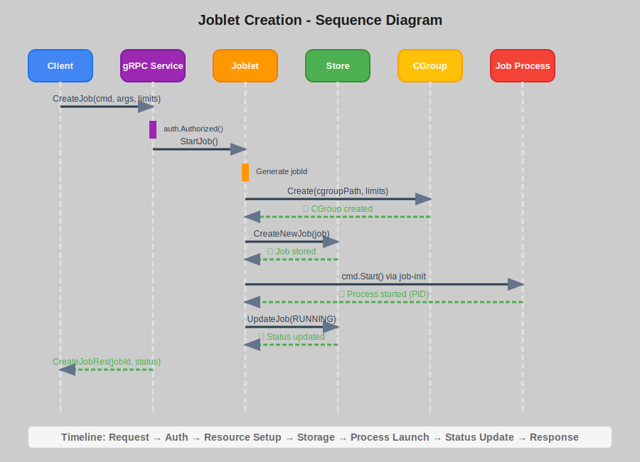
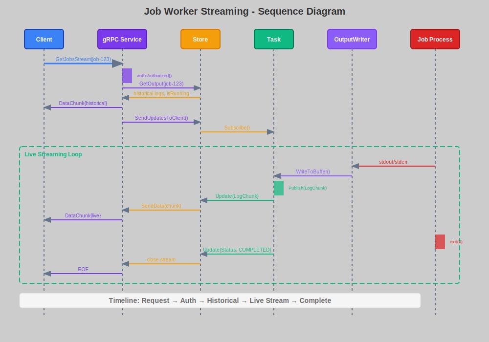

# Job Worker System Design Document

## 1. Overview

The Job Worker is a distributed job execution system that provides secure, resource-controlled execution of arbitrary commands on remote machines. It implements a client-server architecture using gRPC with mutual TLS authentication and fine-grained resource management through Linux cgroups.

### 1.1 Key Features

- **Secure Remote Execution**: Mutual TLS authentication with role-based authorization
- **Resource Management**: CPU, memory, and I/O bandwidth limiting via cgroups v2
- **Real-time Streaming**: Live output streaming of job execution logs
- **Process Isolation**: Containerized execution environment with proper cleanup
- **RESTful API**: gRPC-based API with protobuf serialization

## 2. System Architecture

### 2.1 Sequence Diagram Create Job

#### 2.1.1 Sequence Diagram Create Job



#### 2.1.2 Sequence Diagram Stream Job



### 2.2 Component Overview

| Component | Deployment | Responsibility | Key Files |
|-----------|------------|---------------|-----------|
| **Job Worker Server** | Server Machine | Core job execution engine, gRPC API, resource management | `cmd/server`, `grpc_server.go`, `grpc_service.go`, `service.go` |
| **CLI Client** | Client Machine | Command-line interface for remote job operations | `cmd/cli`, `root.go`, `create.go`, `get.go`, `stop.go`, `stream.go`, `list.go` |
| **job-init Binary** | Server Machine | Process isolation and execution setup (spawned by server) | `cmd/job-init`, `init.go` |

## 3. Server-Side Components (Job Worker)

### 3.1 Job Worker Server

The server runs as a daemon on the target machine and provides the core job execution capabilities.

#### Core Server Components

| Component | Purpose | Implementation |
|-----------|---------|---------------|
| **gRPC Server** | API endpoint with TLS authentication | `grpc_server.go`, `grpc_service.go` |
| **Job Worker Service** | Core job execution logic and lifecycle management | `service.go` |
| **In-Memory Store** | Job state management and real-time pub/sub | `store.go`, `task.go` |
| **Resource Manager** | Linux cgroups v2 resource control | `cgroup.go` |
| **Authorization** | Role-based access control via client certificates | `grpc_authorization.go` |

#### Server Process Flow
```
1. Server starts → Load TLS certificates → Listen on port 50051
2. Client connects → Mutual TLS handshake → Extract role from certificate
3. Client sends request → Authorize operation → Execute job logic
4. Job creation → Setup cgroup → Start job-init → Monitor process
5. Real-time streaming → Pub/sub updates → Send to client
```

### 3.2 Process Execution (job-init)

The `job-init` binary is spawned by the server for each job to ensure proper isolation.

#### Two-Stage Execution Process
```
Server Process                    job-init Process
     │                                  │
     ├─ Create cgroup                   │
     ├─ Setup resource limits           │
     ├─ Start job-init ─────────────────┤
     │                                  ├─ Join cgroup
     │                                  ├─ Resolve command path
     │                                  ├─ exec() target command
     │                                  └─ (process replaced)
     ├─ Monitor process
     ├─ Capture output
     └─ Cleanup on completion
```

#### Server-Side Resource Management
- **Cgroups v2 Integration**: Creates and manages `/sys/fs/cgroup/job-{id}` directories
- **CPU Limiting**: Uses `cpu.max` for percentage-based limits
- **Memory Limiting**: Uses `memory.max` and `memory.high` for hard/soft limits
- **I/O Limiting**: Uses `io.max` for bandwidth control
- **Process Cleanup**: Automatic SIGTERM/SIGKILL and cgroup removal

## 4. Client-Side Interface (CLI)

### 4.1 CLI Client Commands

The CLI client connects to remote Job Worker servers via gRPC/TLS.

#### Available Commands

| Command | Purpose | Required Role | Example |
|---------|---------|---------------|---------|
| `create` | Start a new job on the server | Admin | `cli create --server=host:50051 echo "hello"` |
| `get` | Retrieve job information | Admin/Viewer | `cli get --server=host:50051 <job-id>` |
| `list` | List all jobs on the server | Admin/Viewer | `cli list --server=host:50051` |
| `stop` | Terminate a running job | Admin | `cli stop --server=host:50051 <job-id>` |
| `stream` | Real-time log streaming | Admin/Viewer | `cli stream --server=host:50051 <job-id>` |

#### CLI Configuration
```bash
# Global server configuration
./job-worker-cli --server=remote-host:50051 --cert-path=./certs <command>

# Per-command usage
./job-worker-cli create --max-cpu=50 --max-memory=512 python3 script.py
./job-worker-cli stream <job-id> --follow
```

### 4.2 Client Authentication

#### Certificate-Based Authentication
- **Client Certificates**: Must be signed by the same CA as the server
- **Role Extraction**: Role determined by `OU` field in certificate subject
- **Mutual TLS**: Both client and server validate each other's certificates

#### Role-Based Access Control
```
Certificate Subject: CN=client-name, OU=admin|viewer, O=organization

Admin Role (OU=admin):
  ✅ create, get, list, stop, stream

Viewer Role (OU=viewer):  
  ✅ get, list, stream
  ❌ create, stop
```

### 4.3 Client-Server Communication

#### gRPC Service Definition
```protobuf
service JobService {
    rpc CreateJob(CreateJobReq) returns (CreateJobRes);     // Admin only
    rpc GetJob(GetJobReq) returns (GetJobRes);              // Admin/Viewer
    rpc StopJob(StopJobReq) returns (StopJobRes);           // Admin only
    rpc GetJobs(EmptyRequest) returns (Jobs);               // Admin/Viewer
    rpc GetJobsStream(GetJobsStreamReq) returns (stream DataChunk); // Admin/Viewer
}
```

#### Request/Response Flow
```
1. Client: job-worker-cli create python3 script.py
2. Client: Establish TLS connection to server
3. Client: Send CreateJobReq with command and args
4. Server: Validate admin permissions
5. Server: Create cgroup and start job-init
6. Server: Return CreateJobRes with job metadata
7. Client: Display job ID and status to user
```

## 5. Deployment Architecture

### 5.1 Server Deployment

#### System Requirements
- **Operating System**: Linux with cgroups v2 support
- **Privileges**: Root access for cgroup management
- **Network**: Open port 50051 for gRPC communication
- **Certificates**: Server certificate and CA certificate

#### Server Installation
```bash
# On the server machine
sudo ./job-worker &  # Runs as daemon
# Server listens on 0.0.0.0:50051
# Requires ./certs/ directory with TLS certificates
```

### 5.2 Client Deployment

#### Client Installation
```bash
# On client machines (any OS)
./job-worker-cli --server=server-host:50051 list
# Requires client certificate for authentication
```

#### Multi-Client Support
- **Concurrent Clients**: Server supports multiple simultaneous client connections
- **Real-time Streaming**: Multiple clients can stream the same job's output
- **Load Balancing**: Clients can connect to different server instances

## 6. Job Lifecycle Management

### 6.1 Job States
```
INITIALIZING → RUNNING → COMPLETED/FAILED/STOPPED
```

- **INITIALIZING**: Job created, cgroup setup, process starting
- **RUNNING**: Process executing, output streaming available
- **COMPLETED**: Process finished successfully (exit code 0)
- **FAILED**: Process finished with error (exit code != 0)
- **STOPPED**: Process terminated by user request

### 6.2 State Transitions
```go
type Job struct {
    Id         string
    Command    string
    Args       []string
    Limits     ResourceLimits
    Status     JobStatus
    Pid        int32
    CgroupPath string
    StartTime  time.Time
    EndTime    *time.Time
    ExitCode   int32
}
```

## 7. Data Management

### 7.1 Server-Side Data Storage

#### Job Storage
- **Thread-Safe**: Uses `sync.RWMutex` for concurrent access
- **Job State**: Maintains complete job metadata and status
- **Output Buffering**: Captures stdout/stderr in memory buffers

### 7.2 Real-time Communication
```go
type Update struct {
    JobID    string
    LogChunk []byte
    Status   string
}
```

- **Real-time Updates**: Publishes log chunks and status changes
- **Multiple Subscribers**: Supports concurrent log streaming clients
- **Automatic Cleanup**: Removes slow subscribers to prevent memory leaks

### 7.3 Output Management

## 8. Error Handling & Reliability
1. **Historical Logs**: Send accumulated output first
2. **Live Updates**: Stream new output chunks in real-time
3. **Completion**: Close stream when job finishes

#### Buffer Management
- **Memory-based**: All output stored in memory (no disk persistence)
- **Thread-safe**: Concurrent writes from process output
- **Size Limits**: No explicit limits (relies on process lifetime)

## 6. Error Handling & Reliability

### 6.1 Process Management

#### Graceful Shutdown
1. Send `SIGTERM` to process group
2. Wait 100ms for graceful termination
3. Send `SIGKILL` if process still alive
4. Clean up cgroup resources

#### Error Recovery
- **Process Group Killing**: Ensures all child processes are terminated
- **Cgroup Cleanup**: Automatic resource cleanup on job completion
- **Emergency Cleanup**: Panic recovery with forced resource cleanup

### 6.2 Resource Cleanup

#### Automatic Cleanup
```go
func (cg *cgroup) CleanupCgroup(jobID string) {
    // 1. Kill remaining processes in cgroup
    // 2. Remove cgroup directory
    // 3. Clean up file descriptors
}
```

#### Timeout Handling
- **Cleanup Timeout**: 30-second limit for cgroup cleanup operations
- **Context Cancellation**: Proper handling of client disconnections
- **Resource Leak Prevention**: Ensures cleanup happens even on failures

## 7. Configuration & Deployment

### 7.1 Server Configuration

#### TLS Certificate Setup
```
./certs/
├── ca-cert.pem      # Certificate Authority
├── server-cert.pem  # Server certificate
├── server-key.pem   # Server private key
└── client-*.pem     # Client certificates
```

#### Network Configuration
- **Default Address**: `0.0.0.0:50051`
- **Protocol**: gRPC over TLS 1.3
- **Message Limits**: Configurable max message sizes

### 7.2 System Requirements

#### Linux Dependencies
- **Cgroups v2**: Must be enabled and mounted
- **Systemd**: Recommended for cgroup management
- **Certificates**: Valid TLS certificates for mutual authentication

#### Resource Requirements
- **Memory**: Scales with number of concurrent jobs and output buffer sizes
- **CPU**: Minimal overhead, primarily limited by job workloads
- **Storage**: No persistent storage required (in-memory only)

## 8. Performance Characteristics

### 8.1 Scalability

#### Concurrent Jobs
- **In-Memory Limits**: Bounded by available system memory
- **Process Limits**: Limited by system `ulimit` settings
- **Cgroup Limits**: Limited by kernel cgroup hierarchy depth

#### Streaming Performance
- **Low Latency**: Real-time output streaming with minimal buffering
- **Multiple Clients**: Concurrent streaming to multiple clients per job
- **Backpressure**: Automatic slow client removal to prevent memory exhaustion

### 8.2 Resource Efficiency

#### Memory Usage
- **Per Job Overhead**: ~1-2KB base overhead per job
- **Output Buffering**: Scales with job output volume
- **Pub/Sub System**: Minimal overhead with automatic cleanup

#### CPU Usage
- **Monitoring Overhead**: One goroutine per running job
- **gRPC Processing**: Efficient binary serialization
- **Resource Management**: Minimal cgroup operation overhead

## 9. Security Considerations

### 9.1 Threat Model

#### Protected Against
- **Unauthorized Access**: Mutual TLS with certificate validation
- **Privilege Escalation**: Process isolation via cgroups
- **Resource Exhaustion**: Configurable resource limits
- **Information Disclosure**: Role-based access control

#### Limitations
- **Root Access**: Requires root privileges for cgroup management
- **Local Attacks**: No protection against local root compromise
- **Certificate Management**: Manual certificate distribution required

### 9.2 Best Practices

#### Operational Security
- **Certificate Rotation**: Regular renewal of TLS certificates
- **Principle of Least Privilege**: Use Viewer role where possible
- **Network Isolation**: Deploy in controlled network environments
- **Audit Logging**: Comprehensive operation logging

## 10. Future Enhancements

### 10.1 Potential Improvements

#### Persistence Layer
- **Job History**: Persistent storage for completed jobs
- **Output Archival**: Long-term log storage
- **Database Integration**: SQL/NoSQL backend options

#### Advanced Features
- **Job Scheduling**: Cron-like scheduling capabilities
- **Job Dependencies**: Chain job execution based on dependencies
- **Resource Quotas**: Per-user or per-tenant resource limits
- **Metrics & Monitoring**: Prometheus integration

#### Scalability Enhancements
- **Horizontal Scaling**: Multi-node job distribution
- **Load Balancing**: Job placement optimization
- **Container Integration**: Docker/Podman support
- **Kubernetes Operator**: Native Kubernetes integration

### 10.2 Technical Debt

#### Known Limitations
- **In-Memory Only**: No persistence across server restarts
- **Single Node**: No distributed execution capability
- **Limited Platforms**: Linux-only due to cgroups dependency
- **Certificate Management**: Manual certificate provisioning

This design document provides a comprehensive overview of the Job Worker system architecture, implementation details, and operational considerations. The system prioritizes security, resource isolation, and real-time monitoring while maintaining simplicity and reliability.