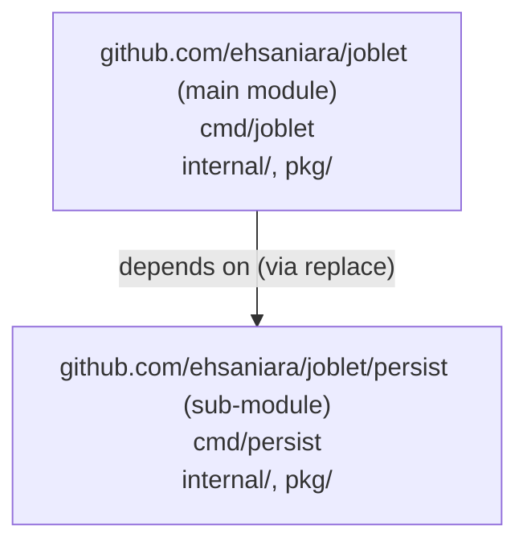
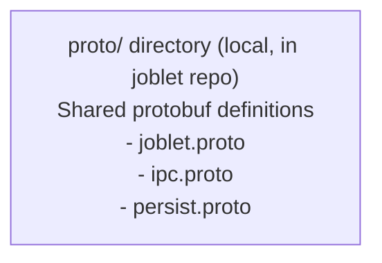

# Joblet Developer Guide

**Date:** 2025-10-12
**Status:** ✅ Current

## Overview

This guide covers development workflows, building, testing, and working with the Joblet monorepo.

For system architecture overview, see [ARCHITECTURE.md](ARCHITECTURE.md).

The joblet repository is a **Go monorepo** containing two modules:

1. **joblet** (main module) - Job execution platform (Linux-native)
2. **joblet/persist** (sub-module) - Storage/persistence service (cloud-ready)

This structure allows different dependencies for each module while keeping them in the same repository.

---

## Directory Structure

```text
joblet/ (repo root)
├── go.work                    # Go workspace file
├── go.mod                     # Main module: github.com/ehsaniara/joblet
├── go.sum
│
├── cmd/
│   └── joblet/                # Main daemon binary
│       └── main.go
│
├── internal/                  # Joblet internals (private)
│   ├── joblet/                # Core job execution
│   └── modes/                 # Execution modes (server, init)
│
├── pkg/                       # Joblet packages (public)
│   ├── config/
│   ├── logger/
│   ├── client/
│   └── ...
│
├── api/                       # Generated gRPC code
│   └── gen/
│
├── persist/                   # Separate module for persistence
│   ├── go.mod                 # Module: github.com/ehsaniara/joblet/persist
│   ├── go.sum
│   │
│   ├── cmd/
│   │   └── persist/    # Persist service binary
│   │       └── main.go
│   │
│   ├── internal/              # Persist internals (private)
│   │   ├── ipc/               # IPC server
│   │   ├── storage/           # Storage backends
│   │   ├── server/            # gRPC server
│   │   ├── config/
│   │   └── query/
│   │
│   ├── pkg/                   # Persist packages (public)
│   │   └── errors/
│   │
│   ├── README.md              # Persist-specific docs
│   └── config.example.yml
│
├── scripts/                   # Build and deployment scripts
│   ├── build-deb.sh
│   ├── build-rpm.sh
│   └── ...
│
├── debian/                    # Debian packaging
│   ├── postinst
│   └── ...
│
├── docs/                      # Documentation
│   ├── ARCHITECTURE.md
│   ├── RNX_PERSIST_CONNECTION.md
│   └── MONOREPO_STRUCTURE.md  # This file
│
├── Makefile                   # Build orchestration
└── README.md                  # Main documentation
```

---

## Module Structure

### Main Module: `github.com/ehsaniara/joblet`

**Purpose:** Core job execution platform (Linux-native)

**Binaries:**

- `cmd/joblet/` → `bin/joblet` (daemon)

The `rnx` CLI client lives in its own repository,
[joblet-rnx](https://github.com/ehsaniara/joblet-rnx); `make rnx` resolves a
binary into `bin/rnx` via `scripts/get-rnx.sh` for deploy/e2e use.

**Dependencies:**

- Linux-specific isolation libraries
- gRPC for API
- No cloud SDKs (stays lightweight)

**go.mod:**

```go
module github.com/ehsaniara/joblet

require (
    github.com/ehsaniara/joblet-proto/v2 v2.6.0
    google.golang.org/grpc v1.77.0
    ...
)
```

### Persist Module: `github.com/ehsaniara/joblet/persist`

**Purpose:** Storage and persistence service (cloud-ready)

**Binaries:**

- `persist/cmd/persist/` → `bin/persist`

**Dependencies:**

- Can include AWS SDK (for CloudWatch, S3)
- Prometheus client
- Cloud storage libraries

**go.mod:**

```go
module github.com/ehsaniara/joblet/persist

require (
    github.com/ehsaniara/joblet-proto v2.0.1+incompatible
    google.golang.org/grpc v1.76.0
    gopkg.in/yaml.v3 v3.0.1
    // Future: AWS SDK, cloud storage libs
)

replace github.com/ehsaniara/joblet-proto => ../../joblet-proto
```

---

## Go Workspace

The `go.work` file enables both modules to work together:

```go
go 1.24.0

use (
	.           # Main joblet module
	./persist   # Persist sub-module
)
```

**Benefits:**

- Both modules can be developed simultaneously
- IDE understands cross-module references
- `go build` works from any directory
- No need to publish persist module separately

---

## Building

### One-time setup: compile the BPF objects

The joblet daemon embeds compiled BPF programs (`internal/joblet/ebpf/telematics/telematics_*_bpfel.o`). These are not
tracked in git: bytes depend on local `clang`/`llvm`/`libbpf-dev` versions and are rebuilt from `bpf/telematics.c`. Run
once after clone, and whenever you edit a `.c` file:

```bash
sudo apt-get install -y clang llvm libbpf-dev   # Ubuntu/Debian
make bpf
```

`make bpf` runs `go generate ./internal/joblet/ebpf/telematics`, which produces both the amd64 and arm64 `.o` files in a
single invocation. Without it, building `joblet` will fail with `pattern telematics_*.o: no matching files found`.

> CLI contributors work in the [joblet-rnx](https://github.com/ehsaniara/joblet-rnx) repository, which has no BPF
> dependency.

### Build All Binaries

```bash
# From repo root
make all

# Or manually:
go build -o bin/joblet ./cmd/joblet
cd persist && go build -o ../bin/persist ./cmd/persist
```

### Build Individual Binaries

```bash
# Joblet daemon
go build -o bin/joblet ./cmd/joblet

# Persist service (must be in persist/ directory)
cd persist && go build -o ../bin/persist ./cmd/persist

# rnx CLI (resolved from joblet-rnx: $RNX_BINARY, sibling checkout, or release download)
make rnx
```

### Cross-compile for Linux

```bash
GOOS=linux GOARCH=amd64 go build -o bin/joblet ./cmd/joblet
cd persist && GOOS=linux GOARCH=amd64 go build -o ../bin/persist ./cmd/persist
```

---

## Import Paths

### Importing from Main Module

```go
// From any file in the repo
import (
    "github.com/ehsaniara/joblet/internal/joblet"
    "github.com/ehsaniara/joblet/pkg/config"
    "github.com/ehsaniara/joblet/pkg/logger"
)
```

### Importing from Persist Module

```go
// From cmd/joblet (main module) - can import persist
import (
    "github.com/ehsaniara/joblet/persist/internal/storage"  // ❌ CANNOT import internal
    "github.com/ehsaniara/joblet/persist/pkg/logger"        // ✅ CAN import pkg
)

// From persist/cmd/persist (persist module) - can import its own internals
import (
    "github.com/ehsaniara/joblet/persist/internal/storage"  // ✅ OK - same module
    "github.com/ehsaniara/joblet/persist/pkg/logger"        // ✅ OK
)
```

**Go Rule:** `internal/` packages can only be imported by code in the **same module**.

---

## Module Dependencies



Both modules use shared protobuf definitions from:



---

## Dependency Management

### Adding Dependencies to Main Module

```bash
go get github.com/some/package@version
go mod tidy
```

### Adding Dependencies to Persist Module

```bash
cd persist
go get github.com/aws/aws-sdk-go-v2@version  # Example: cloud SDK
go mod tidy
cd ..
```

### Updating Proto Definitions

Proto files are now maintained directly in the `proto/` directory:

```bash
# Edit proto files
vim proto/joblet.proto

# Regenerate code
make proto

# Or manually:
./scripts/generate-proto.sh
```

---

## Testing

### Unit Tests

Run all unit tests across the codebase:

```bash
# Test main module
go test ./...

# Test persist module
cd persist && go test ./...

# Test all modules
go test ./... && cd persist && go test ./...
```

### E2E Tests

End-to-end tests validate complete workflows against a running joblet instance.

**Location:** `tests/e2e/`

**Requirements:**

- Remote joblet instance running
- SSH access configured
- RNX CLI configured for remote host

**Running E2E Tests:**

The default flow is a clean-room validation: remove previous build artifacts,
purge any existing joblet/rnx install, build and install a .deb from the
working tree, then run every suite against that packaged install (needs
sudo, run in a real terminal). Runs fail fast: the first failing test aborts
its suite and stops the whole run.

```bash
# Full clean install + all e2e tests (default)
cd tests/e2e
./run_tests.sh

# Debugging only: test whatever is already running (no build, no install)
SKIP_DEPLOY=1 ./run_tests.sh

# Run specific test against the running service
./tests/01_isolation_test.sh

# Run with custom host
JOBLET_TEST_HOST=192.0.2.10 JOBLET_TEST_USER=admin ./run_tests.sh
```

**Available E2E Tests:**

1. `01_isolation_test.sh` - Process isolation validation
2. `02_runtime_test.sh` - Runtime management
3. `03_network_test.sh` - Network isolation
4. `04_schedule_test.sh` - Job scheduling
5. `05_volume_test.sh` - Volume management
6. `08_rnx_json_test.sh` - JSON output format
7. `09_gpu_test.sh` - GPU allocation
8. `10_persist_test.sh` - Log/metric persistence
9. `11_metrics_gap_test.sh` - Metrics continuity
10. `12_log_gap_simple_test.sh` - Log continuity (simple)
11. `13_log_gap_live_test.sh` - Log continuity (live)
12. `15_state_load_test.sh` - State client load test (1000+ jobs)
13. `16_ebpf_telemetry_test.sh` - eBPF telemetry collection
14. `17_telematics_gap_test.sh` - Telematics continuity
15. `18_timeout_test.sh` - Job timeout enforcement
16. `19_gpu_mock_test.sh` - GPU allocation (mock devices)

**State Load Tests:**

The state load test validates connection pool performance with high concurrency:

```bash
# Run with default 100 jobs
./tests/15_state_load_test.sh

# Full load test with 1000 jobs
./tests/15_state_load_test.sh 1000

# Custom pool size
./tests/15_state_load_test.sh 1000 50
```

**Go-Based Load Tests:**

For programmatic load testing:

```bash
# Run Go load tests (requires running state service)
go test -v ./tests/e2e -run TestStateClient_Load

# Specific test
go test -v ./tests/e2e -run TestStateClient_Load1000

# Skip if state service unavailable (auto-skips by default)
go test -short ./tests/e2e
```

**Documentation:** See `tests/e2e/README_STATE_TESTS.md` for detailed load testing documentation.

---

## Packaging

The server binaries are included in the same `.deb` and `.rpm` packages; the
`rnx` client is packaged and released separately from
[joblet-rnx](https://github.com/ehsaniara/joblet-rnx):

**Debian (.deb):**

```text
/opt/joblet/bin/
├── joblet           # From cmd/joblet
└── persist   # From persist/cmd/persist
```

**RPM (.rpm):**

```text
/opt/joblet/bin/
├── joblet
└── persist
```

---

## Key Benefits

### 1. **Separate Dependencies**

- `joblet` stays lightweight (Linux-native only)
- `persist` can add cloud SDKs without bloating core

### 2. **Single Repository**

- One place for all code
- Synchronized versioning
- Atomic commits across both

### 3. **Go Workspaces**

- Both modules work together seamlessly
- No need to publish persist separately
- IDE autocomplete works across modules

### 4. **Clean Architecture**

- `internal/` enforces encapsulation
- Clear separation of concerns
- Testable components

---

## Migration Notes

### What Changed

**Before:**

```text
joblet/              # One module
├── go.mod
├── cmd/
│   ├── joblet/
│   ├── rnx/
│   └── persist/
├── internal/
└── pkg/

persist/      # Separate repo
├── go.mod
├── cmd/
├── internal/
└── pkg/
```

**After:**

```text
joblet/              # Monorepo with 2 modules
├── go.work          # NEW
├── go.mod           # Main module
├── cmd/
│   └── joblet/      # (rnx later moved to the joblet-rnx repo)
├── internal/
├── pkg/
└── persist/         # Sub-module
    ├── go.mod       # Persist module
    ├── cmd/
    │   └── persist/
    ├── internal/
    └── pkg/
```

### Import Changes

All imports updated from:

```go
import "joblet/internal/..."           // Old
import "persist/internal/..."   // Old
```

To:

```go
import "github.com/ehsaniara/joblet/internal/..."         // New
import "github.com/ehsaniara/joblet/persist/internal/..." // New
```

---

## Future Enhancements

### v2.0: Cloud Storage Backends

```go
// persist/go.mod
require (
    github.com/aws/aws-sdk-go-v2 v1.x.x
    github.com/aws/aws-sdk-go-v2/service/cloudwatchlogs v1.x.x
    github.com/aws/aws-sdk-go-v2/service/s3 v1.x.x
)
```

### v2.1: Shared Utilities Module

```text
joblet/
├── shared/          # Optional third module
│   ├── go.mod       # github.com/ehsaniara/joblet/shared
│   └── pkg/
│       ├── logger/  # Used by both joblet and persist
│       └── config/
```

---

## Troubleshooting

### "package is not in std"

**Cause:** Old import paths
**Fix:** Run `find internal pkg -name "*.go" -exec sed -i 's|"joblet/|"github.com/ehsaniara/joblet/|g' {} \;`

### "use of internal package not allowed"

**Cause:** Trying to import `internal/` from different module
**Fix:** Move code to `pkg/` or keep cmd in the same module

### "no required module provides package"

**Cause:** Missing replace directives
**Fix:** Ensure both modules have correct replace directives:

- Root go.mod: `replace github.com/ehsaniara/joblet/persist => ./persist`
- persist/go.mod: `replace github.com/ehsaniara/joblet => ../`

### Build fails after git pull

**Fix:**

```bash
go mod tidy
cd persist && go mod tidy
```

---

## Status

✅ **Fully Implemented**
✅ **All Binaries Build Successfully**
✅ **Go Workspace Configured**
✅ **Import Paths Updated**
✅ **Ready for Development**

---

**Version:** joblet v1.0.0+monorepo
**Last Updated:** 2025-10-12
