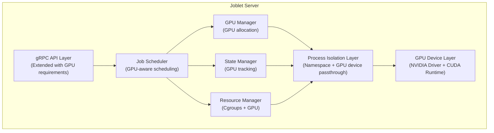

# GPU Support Architecture Design Document for Joblet

## Executive Summary

This document outlines the architecture design for adding NVIDIA GPU support to the Joblet platform. The design enables
secure GPU passthrough to isolated jobs while maintaining the existing security model through Linux namespaces and
cgroups v2.

## 1. System Architecture Overview

### 1.1 High-Level Architecture



### 1.2 Component Responsibilities

- **GPU Manager**: Discovers, allocates, and manages GPU devices
- **GPU Scheduler**: Implements GPU-aware job scheduling with anti-affinity rules
- **GPU Resource Controller**: Enforces GPU memory and compute limits via cgroups
- **GPU Device Passthrough**: Manages device node creation and permissions
- **CUDA Runtime Manager**: Handles CUDA library mounting and environment setup
- **GPU Monitoring**: Collects and reports GPU metrics via nvidia-smi

## 2. Detailed Component Design

### 2.1 GPU Manager Component

#### Purpose

Central management of GPU resources across the system, handling discovery, allocation, and lifecycle management.

#### Responsibilities

- GPU device discovery and enumeration at startup
- GPU health checking and availability tracking
- GPU allocation and deallocation for jobs
- GPU state persistence and recovery
- Multi-GPU allocation strategies (pack, spread, exclusive)

#### Interfaces

- `DiscoverGPUs()`: Enumerate available GPU devices
- `AllocateGPU(requirements)`: Allocate GPUs based on job requirements
- `ReleaseGPU(jobID)`: Release GPU allocation after job completion
- `GetGPUStatus()`: Return current GPU allocation status
- `ValidateGPURequirements()`: Check if requirements can be satisfied

### 2.2 GPU Device Discovery

#### Detection Methods

1. **Primary**: Parse `/proc/driver/nvidia/gpus/` directory structure
2. **Secondary**: Query nvidia-ml library via dynamic loading
3. **Fallback**: Execute nvidia-smi and parse output

#### GPU Information Model

```yaml
GPUDevice:
  index: integer (0-based GPU index)
  uuid: string (GPU UUID from driver)
  name: string (e.g., "NVIDIA A100-SXM4-80GB")
  pci_bus_id: string (e.g., "0000:00:1E.0")
  compute_capability: string (e.g., "8.0")
  memory_total_mb: integer
  memory_available_mb: integer
  utilization_gpu: integer (0-100)
  utilization_memory: integer (0-100)
  temperature_celsius: integer
  power_watts: integer
  driver_version: string
  cuda_version: string
  mig_mode: boolean
  mig_devices: array (if MIG enabled)
```

### 2.3 Resource Isolation Integration

> ⚠️ **DESIGN / PLANNED - not delivered.** The cgroups v2 device controller and GPU memory limits
> described in this section are the intended design and are **not** wired into the current execution
> path: `--gpu-memory` is only used to filter candidate GPUs at selection time, not enforced at
> runtime. Note that cgroups v2 has no standalone "devices" controller (device access is governed via
> eBPF programs, not `devices.allow`/`devices.deny` files); in practice a job's GPU device access is
> bounded by which `/dev/nvidia*` nodes the filesystem isolator creates (see §2.4), not by cgroup
> device rules.

#### Cgroups v2 Device Controller

```yaml
Device Rules:
  - major:
      195, minor: 0-255  # /dev/nvidia[0-9] and /dev/nvidiactl
  - major:
      237, minor: 0       # /dev/nvidia-uvm
  - major:
      238, minor: 0       # /dev/nvidia-uvm-tools
  - major:
      239, minor: 0-255   # /dev/nvidia-modeset

Permissions: "rwm" (read, write, mknod)

Cgroup Path Structure:
  /sys/fs/cgroup/joblet.slice/joblet.service/job-{JOB_ID}/
  ├── devices.allow    # GPU device allowlist
  ├── devices.deny     # GPU device denylist
  └── devices.list     # Current device permissions
```

#### GPU Memory Limits

- **Method 1**: CUDA environment variables (`CUDA_DEVICE_MAX_MEMORY`)
- **Method 2**: nvidia-ml API for runtime enforcement
- **Method 3**: MIG (Multi-Instance GPU) partitioning for hard limits

### 2.4 Filesystem Isolation Extensions

> ⚠️ **IMPLEMENTED - pending validation on GPU hardware.** The chroot GPU device-node creation
> (`mknod`) and CUDA library bind-mounts described here are now wired into the execution path. The
> server (`coordinator.setupGPUEnvironment`) forwards the allocated GPU indices and detected CUDA
> paths to the init process via the `JOB_GPU_INDICES` / `JOB_GPU_CUDA_MOUNTS` env vars, and the
> init-side filesystem `Setup()` (`internal/joblet/core/filesystem/isolator.go`) invokes
> `CreateGPUDeviceNodes` (post-chroot) and `MountCUDALibraries` (pre-chroot). This path has not yet
> been exercised on a host with an NVIDIA GPU, so it remains pending end-to-end validation.

#### GPU Device Nodes in Chroot

```yaml
Required Device Nodes:
  /dev/nvidia0-N: GPU devices (char 195:0-N)
  /dev/nvidiactl: Control device (char 195:255)
  /dev/nvidia-uvm: Unified Memory (char 237:0)
  /dev/nvidia-uvm-tools: UVM tools (char 238:0)
  /dev/nvidia-modeset: Modeset device (char 239:0)
```

#### CUDA Library Mount Points

```yaml
Library Paths:
  - /usr/local/cuda/lib64      # CUDA runtime libraries
  - /usr/lib/x86_64-linux-gnu  # System NVIDIA libraries
  - /usr/lib64/nvidia          # Driver-specific libraries
  - /opt/nvidia                # Optional custom installations

Mount Strategy:
  - Read-only bind mounts
  - Lazy unmounting on cleanup
  - Version compatibility checking
```

### 2.5 Job Scheduling Extensions

#### GPU-Aware Scheduling Algorithm

```yaml
Scheduling Strategies:
  BestFit:
    - Select GPU with least available memory that fits requirements
    - Maximize GPU utilization

  WorstFit:
    - Select GPU with most available resources
    - Minimize interference between jobs

  Exclusive:
    - Dedicate entire GPU to single job
    - No sharing regardless of utilization

  Spread:
    - Distribute jobs across all available GPUs
    - Balance thermal and power load
```

#### GPU Affinity Rules

```yaml
Affinity Types:
  Required:
    - Job must run on specific GPU indices
    - Fail if unavailable

  Preferred:
    - Prefer specific GPUs but allow alternatives
    - Best-effort allocation

  Anti-Affinity:
    - Avoid co-location with specific job types
    - Separate training from inference workloads
```

## 3. API Specifications

### 3.1 gRPC API Extensions

#### RunJobRequest Enhancement

```protobuf
message GPURequirements {
  int32 count = 1;                          // Number of GPUs needed
  int32 memory_mb_per_gpu = 2;              // Minimum memory per GPU
  string compute_capability_min = 3;        // e.g., "7.0"
  bool exclusive = 4;                       // Exclusive GPU access
  repeated int32 preferred_indices = 5;     // Preferred GPU indices
  string allocation_strategy = 6;           // BestFit, WorstFit, Spread
  bool allow_mig = 7;                       // Allow MIG instances
  map<string, string> annotations = 8;      // Custom GPU annotations
}

message RunJobReq {
  // ... existing fields ...
  GPURequirements gpu_requirements = 10;
  bool cuda_runtime_mount = 11;            // Auto-mount CUDA libraries
  string cuda_version = 12;                // Required CUDA version
}
```

#### JobStatus Enhancement

```protobuf
message GPUAllocation {
  int32 index = 1;
  string uuid = 2;
  string name = 3;
  int32 memory_allocated_mb = 4;
  bool exclusive = 5;
  string mig_instance = 6;                 // MIG instance UUID if applicable
}

message GPUMetrics {
  int32 index = 1;
  float gpu_utilization = 2;               // 0-100%
  float memory_utilization = 3;            // 0-100%
  int32 memory_used_mb = 4;
  int32 temperature_celsius = 5;
  int32 power_watts = 6;
  int64 gpu_time_ms = 7;                   // Total GPU compute time
}

message JobStatus {
  // ... existing fields ...
  repeated GPUAllocation gpu_allocations = 15;
  repeated GPUMetrics gpu_metrics = 16;
  string cuda_version_used = 17;
}
```

### 3.2 Configuration Schema

#### Server Configuration Extension

```yaml
# /opt/joblet/config/server-config.yml
gpu:
  enabled: true
  discovery_method: "auto"  # auto, nvidia-ml, nvidia-smi, proc

  # GPU allocation settings
  allocation:
    default_strategy: "BestFit"  # BestFit, WorstFit, Spread
    allow_sharing: true
    max_jobs_per_gpu: 4

  # Resource limits
  limits:
    enforce_memory_limits: true
    memory_overhead_mb: 512  # Reserved for driver/CUDA

  # CUDA runtime settings
  cuda:
    mount_libraries: true
    library_paths:
      - "/usr/local/cuda/lib64"
      - "/usr/lib/x86_64-linux-gnu"
    supported_versions:
      - "11.8"
      - "12.0"
      - "12.2"

  # MIG (Multi-Instance GPU) support
  mig:
    enabled: false
    auto_configure: false

  # Monitoring
  monitoring:
    collect_metrics: true
    metrics_interval: "10s"
    nvidia_smi_path: "/usr/bin/nvidia-smi"
```

#### Runtime Configuration with GPU

```yaml
# Runtime with GPU support
runtime:
  name: "python-3.11-ml-cuda"
  base_path: "/opt/joblet/runtimes/python-3.11-ml-cuda"
  requirements:
    gpu: true
    cuda_version: "12.0"
    compute_capability: "7.0"
  environment:
    CUDA_HOME: "/usr/local/cuda"
    LD_LIBRARY_PATH: "${LD_LIBRARY_PATH}:/usr/local/cuda/lib64"
```

## 4. Security Considerations

### 4.1 GPU Access Control

#### Device Permission Model

- **Default Deny**: No GPU access unless explicitly requested
- **Capability-Based**: Jobs must declare GPU requirements upfront
- **Resource Quotas**: Per-user/role GPU allocation limits
- **Audit Logging**: All GPU allocations logged for compliance

#### Isolation Guarantees

- **Memory Isolation**: GPU memory not accessible across jobs
- **Compute Isolation**: No interference between GPU kernels (MIG)
- **Driver Isolation**: Each job sees virtualized driver interface
- **CUDA Context Isolation**: Separate CUDA contexts per job

### 4.2 Attack Surface Mitigation

#### Potential Attack Vectors

1. **GPU Memory Leakage**: Previous job's data in GPU memory
2. **Side-Channel Attacks**: Timing attacks via GPU utilization
3. **Resource Exhaustion**: Monopolizing GPU resources
4. **Driver Exploitation**: Malicious CUDA kernels

#### Mitigation Strategies

- **Memory Zeroing**: Clear GPU memory between jobs
- **Resource Limits**: Hard limits on GPU memory and compute time
- **Driver Sandboxing**: Run jobs with minimal driver privileges
- **Kernel Module Security**: Restrict GPU kernel module operations
- **Rate Limiting**: Limit GPU allocation frequency per user

## 5. Monitoring and Observability

### 5.1 GPU Metrics Collection

#### System-Level Metrics

```yaml
GPU System Metrics:
  - gpu.count.total: Total GPUs in system
  - gpu.count.available: Available for allocation
  - gpu.count.allocated: Currently allocated
  - gpu.memory.total: Total GPU memory (all GPUs)
  - gpu.memory.allocated: Allocated GPU memory
  - gpu.utilization.average: Average GPU utilization
  - gpu.temperature.max: Maximum GPU temperature
  - gpu.power.total: Total GPU power consumption
```

#### Job-Level Metrics

```yaml
GPU Job Metrics:
  - job.gpu.count: Number of GPUs allocated
  - job.gpu.memory.requested: Requested GPU memory
  - job.gpu.memory.used.max: Peak GPU memory usage
  - job.gpu.utilization.average: Average GPU utilization
  - job.gpu.kernel.time: Total kernel execution time
  - job.cuda.version: CUDA version used
  - job.cuda.errors: CUDA runtime errors
```

### 5.2 Logging Requirements

#### GPU Event Logging

```yaml
Log Events:
  GPU_DISCOVERED:
    - timestamp, gpu_index, uuid, name, memory
  GPU_ALLOCATED:
    - timestamp, job_id, gpu_index, exclusive, memory_limit
  GPU_RELEASED:
    - timestamp, job_id, gpu_index, duration, peak_memory
  GPU_ERROR:
    - timestamp, job_id, gpu_index, error_type, details
  GPU_OOM:
    - timestamp, job_id, gpu_index, requested, available
```

## 6. Testing Requirements

### 6.1 Unit Testing

- GPU discovery with mocked /proc filesystem
- Allocation algorithm correctness
- Resource limit enforcement
- Error handling and recovery

### 6.2 Integration Testing

- GPU device passthrough validation
- CUDA library mounting verification
- Multi-GPU job execution
- GPU cleanup after job termination

### 6.3 Performance Testing

- GPU allocation latency
- Concurrent GPU job handling
- Memory limit enforcement overhead
- Monitoring system impact

### 6.4 Security Testing

- GPU memory isolation verification
- Device permission enforcement
- Resource exhaustion prevention
- Side-channel attack mitigation

## 7. Implementation Phases

### Phase 1: Foundation (Week 1-2)

- GPU discovery and enumeration
- Basic device information model
- System metrics integration

### Phase 2: Core Functionality (Week 3-4)

- GPU allocation manager
- Cgroups device controller integration
- Device node management in chroot

### Phase 3: Runtime Support (Week 5-6)

- CUDA library detection and mounting
- Runtime version compatibility
- Environment variable configuration

### Phase 4: Advanced Features (Week 7-8)

- GPU memory and compute limits
- MIG support (optional)
- Advanced scheduling strategies

### Phase 5: Production Readiness (Week 9-10)

- Comprehensive testing
- Performance optimization
- Documentation and training

## 8. Success Criteria

### Functional Requirements

> ⚠️ These are target criteria. Checkmarks below indicate design intent, not current delivery
> status. Each item is annotated with its actual state: *(working)*, *(implemented - pending
> GPU-hardware validation)*, *(partial)*, or *(not implemented)*.

- ✓ Detect and enumerate NVIDIA GPUs *(working)*
- ✓ Allocate GPUs to jobs based on requirements *(working - in-memory bookkeeping)*
- ✓ Pass through GPU devices to isolated jobs *(implemented - per-job `/dev/nvidia*` nodes created; pending GPU-hardware validation)*
- ✓ Mount CUDA libraries in job environment *(implemented - read-only bind-mount wired; pending GPU-hardware validation)*
- ✓ Enforce GPU resource limits *(not implemented - `--gpu-memory` filters at selection only, not enforced)*
- ✓ Clean up GPU resources after job completion *(partial - allocation bookkeeping released; GPU memory not reliably cleared)*

### Performance Requirements

- GPU allocation latency < 100ms
- Monitoring overhead < 2% CPU
- Support 100+ concurrent GPU jobs
- GPU memory limit accuracy ±50MB

### Security Requirements

- Complete GPU memory isolation between jobs
- No privilege escalation via GPU access
- Audit trail for all GPU operations
- Resource exhaustion prevention

## 9. Dependencies and Constraints

### System Requirements

- Linux kernel 5.4+ with cgroups v2
- NVIDIA driver 470+ installed
- CUDA toolkit 11.0+ (optional)
- nvidia-container-cli (optional)

### Compatibility Matrix

```yaml
Supported Platforms:
  Ubuntu: 20.04 LTS, 22.04 LTS
  RHEL/Rocky: 8.x, 9.x
  Amazon Linux: 2, 2023

GPU Hardware:
  Architecture: Pascal (6.0) and newer
  Memory: 4GB minimum
  Driver Mode: Default or MIG

CUDA Versions:
  Minimum: 11.0
  Recommended: 12.0+
  Multiple versions: Supported via containers
```

## 10. Migration Path

### For Existing Jobs

1. Jobs without GPU requirements continue unchanged
2. Add GPU requirements to job specification
3. System auto-detects and allocates GPUs
4. Gradual rollout with feature flags

### Rollback Strategy

1. GPU support can be disabled via configuration
2. Jobs fall back to CPU-only execution
3. GPU allocations automatically cleaned up
4. No data migration required