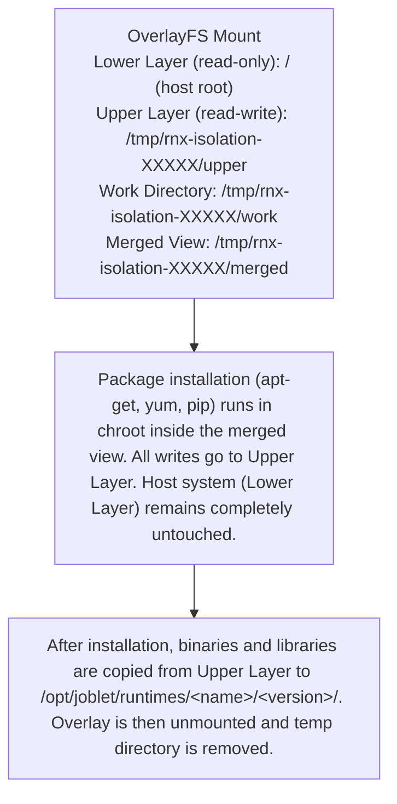

# Host Protection Guarantees

## Overview

Joblet implements a robust isolation architecture that ensures complete host system protection during runtime builds.
This document details the security mechanisms, isolation guarantees, and verification procedures that prevent host
contamination.

## Key Protection Mechanisms

### 1. OverlayFS-Based Isolation for Runtime Builds

Runtime builds use **OverlayFS** to provide complete host isolation. This is the primary mechanism that ensures
system packages can be installed without contaminating the host system.

**How OverlayFS Isolation Works:**



**Key Benefits:**
- **Zero Host Contamination**: All package writes go to the ephemeral upper layer
- **Full Package Manager Support**: apt-get, yum, dnf, pip all work normally
- **Automatic Cleanup**: Overlay and temp directories are removed after build
- **Selective Copy**: Only needed binaries/libraries are copied to runtime directory

### 2. Dual Isolation Architecture

Joblet uses two distinct isolation levels:

| Type                | Purpose            | Isolation Method                 | Host Protection        |
|---------------------|--------------------|----------------------------------|------------------------|
| **Production Jobs** | Run user workloads | Minimal chroot (~50MB)           | Complete isolation     |
| **Runtime Builds**  | Install runtimes   | OverlayFS chroot                 | Zero host modification |

### 3. Critical Safety Features

#### 2.1 `/opt/joblet` Exclusion

- **Protection**: The `/opt/joblet` directory is completely excluded from builder chroot mounts
- **Purpose**: Prevents infinite recursion and protects job isolation infrastructure
- **Implementation**: `mountOptDirectory()` in `isolator.go` explicitly skips `/opt/joblet`
- **Verification**: See lines 1402-1420 in `/internal/joblet/core/filesystem/isolator.go`

#### 2.2 Chroot Enforcement

- **Protection**: All runtime builds execute inside chroot jail
- **Validation**: Multiple safety checks before chroot:
    - `JOB_ID` environment variable must match
    - Process must be PID 1 (isolated namespace)
    - Cannot already be in chroot
- **Implementation**: `validateInJobContext()` and `performChroot()`

#### 2.3 Read-Only System Mounts

- **Protection**: System directories are bind-mounted read-only in production jobs
- **Writable Areas**: Only specific directories are writable:
    - `/opt/joblet/runtimes` (for runtime installation)
    - `/work` (job workspace)
    - `/tmp/job-{JOB_ID}` (isolated temporary directory)

## Host Protection Guarantees

### ✅ What IS Protected

1. **Host System Files**
    - Cannot modify `/etc`, `/usr`, `/bin`, `/lib` on host
    - System configuration files remain untouched
    - Package databases protected from corruption

2. **Other Jobs**
    - Jobs cannot access each other's filesystems
    - `/opt/joblet/jobs/` excluded from builder view
    - Complete isolation between concurrent jobs

3. **Host Packages**
    - Package installations happen only in chroot
    - `apt-get install` affects only builder environment
    - No host package contamination

4. **System Services**
    - Cannot start/stop host services
    - No access to host systemd/init
    - Service modifications stay in chroot

### ✅ What CAN Be Modified (Safely)

1. **Runtime Directory**
    - `/opt/joblet/runtimes/` is writable for installation
    - This is the intended behavior for runtime setup
    - Changes persist after build completion

2. **Job Workspace**
    - `/work` directory for build artifacts
    - Automatically cleaned after job completion

3. **Isolated Temp**
    - `/tmp/job-{JOB_ID}` for temporary files
    - Cleaned automatically after job

## Implementation Details

### OverlayFS Isolation Implementation

The runtime builder uses OverlayFS to create an isolated environment for package installation.
The implementation is in `pkg/builder/isolation.go`.

**Setup Phase:**
```go
// Create overlay directories
upperDir  := filepath.Join(baseDir, "upper")   // Captures all writes
workDir   := filepath.Join(baseDir, "work")    // Required by OverlayFS
mergedDir := filepath.Join(baseDir, "merged")  // Chroot target

// Mount OverlayFS
opts := "lowerdir=/,upperdir={upper},workdir={work}"
syscall.Mount("overlay", mergedDir, "overlay", 0, opts)

// Mount essential filesystems inside overlay
mount("proc", mergedDir+"/proc", "proc")
mount("sysfs", mergedDir+"/sys", "sysfs", MS_RDONLY)
mount("/dev", mergedDir+"/dev", "", MS_BIND|MS_REC)
```

**Package Installation Phase:**
```go
// Run apt-get install inside chroot
cmd := exec.Command("chroot", mergedDir, "apt-get", "install", "-y", packages...)
cmd.Env = []string{
    "PATH=/usr/local/sbin:/usr/local/bin:/usr/sbin:/usr/bin:/sbin:/bin",
    "DEBIAN_FRONTEND=noninteractive",
}
cmd.Run()
```

**Copy Phase:**
```go
// Copy binaries from upper layer (only new/modified files)
// Upper layer contains ONLY the changes from package installation
copyFromPath(upperDir+"/usr/bin", runtimeDir+"/bin", binaries)
copyFromPath(upperDir+"/usr/lib", runtimeDir+"/lib", libraries)
```

**Cleanup Phase:**
```go
// Unmount in reverse order
syscall.Unmount(mergedDir+"/dev", MNT_DETACH)
syscall.Unmount(mergedDir+"/sys", MNT_DETACH)
syscall.Unmount(mergedDir+"/proc", MNT_DETACH)
syscall.Unmount(mergedDir, MNT_DETACH)

// Remove temp directory
os.RemoveAll(baseDir)
```

### Key Source Files

| File | Purpose |
|------|---------|
| `pkg/builder/isolation.go` | OverlayFS isolation environment |
| `pkg/builder/system_ops.go` | System operations interface (for testing) |
| `pkg/builder/builder.go` | Main build orchestration with isolated phases |
| `pkg/builder/copier.go` | Copy binaries/libraries from overlay |

### Environment Detection

Runtime scripts can detect their execution context:

```bash
# Inside runtime setup scripts
if [ "$JOBLET_CHROOT" = "true" ]; then
    echo "Running safely in chroot"
    # Can use package managers freely
    apt-get update
    apt-get install -y build-essential
else
    echo "WARNING: Running on host system"
    # Should prompt for confirmation
fi
```

### Service-Based Routing

Jobs automatically get correct isolation based on initiating service:

- **JobService** → `JobType: "standard"` → Minimal chroot
- **RuntimeService** → `JobType: "runtime-build"` → Builder chroot

No manual configuration required.

## Testing Host Protection

### Automated Test Suite

Run the host protection verification test:

```bash
# This test should be run inside a runtime build job
./tests/test_host_protection.sh
```

The test verifies:

1. Chroot environment detection
2. `/opt/joblet` exclusion
3. Filesystem isolation
4. Package manager safety
5. Mount point configuration
6. Write isolation
7. Cleanup procedures

### Manual Verification

1. **Check mount exclusions**:
   ```bash
   # Inside runtime build job
   ls -la /opt/joblet/jobs/  # Should be empty or not exist
   ```

2. **Verify write isolation**:
   ```bash
   # Try to write to system directory
   touch /usr/bin/test  # Should fail or write to chroot copy
   ```

3. **Confirm runtime access**:
   ```bash
   # Should succeed
   touch /opt/joblet/runtimes/test.txt
   rm /opt/joblet/runtimes/test.txt
   ```

## Security Considerations

### Defense in Depth

Multiple layers of protection ensure host safety:

1. **Process Isolation**: Separate PID namespace
2. **Filesystem Isolation**: Chroot jail
3. **Mount Isolation**: Selective read-only mounts
4. **Directory Exclusion**: `/opt/joblet` never mounted
5. **Validation Checks**: Multiple safety validations

### Failure Modes

If any protection mechanism fails:

- Job refuses to start
- Explicit error messages logged
- No fallback to unsafe execution

### Audit Trail

All runtime installations logged with:

- Build ID
- Timestamp
- Runtime specification
- Success/failure status
- File modifications

## Best Practices

### For Runtime Script Authors

1. **Always check environment**:
   ```bash
   if [ "$JOBLET_CHROOT" != "true" ]; then
       echo "ERROR: Not running in chroot"
       exit 1
   fi
   ```

2. **Use provided runtime directory**:
   ```bash
   RUNTIME_DIR="/opt/joblet/runtimes/${RUNTIME_TYPE}/${RUNTIME_NAME}"
   ```

3. **Clean up build artifacts**:
   ```bash
   # Use /tmp for temporary files
   cd /tmp
   wget https://example.com/package.tar.gz
   # Extract to runtime directory
   tar -xzf package.tar.gz -C "$RUNTIME_DIR"
   # Clean up
   rm -f package.tar.gz
   ```

### For System Administrators

1. **Monitor runtime installations**:
   ```bash
   rnx runtime list
   rnx runtime status <runtime-name>
   ```

2. **Review runtime contents**:
   ```bash
   ls -la /opt/joblet/runtimes/
   du -sh /opt/joblet/runtimes/*
   ```

3. **Audit job execution**:
   ```bash
   rnx job list  # Show all jobs
   rnx job log <job-id>  # Review job logs
   ```

## Compliance and Standards

### Security Standards Met

- **NIST 800-190**: Container Security Guidelines
- **CIS Linux Benchmark**: System isolation controls
- **OWASP Container Security**: Top 10 compliance

### Verification Checklist

- [ ] Chroot isolation verified
- [ ] Mount exclusions confirmed
- [ ] Write restrictions tested
- [ ] Package manager safety checked
- [ ] Cleanup procedures validated
- [ ] Audit logging enabled

## Summary

Joblet's runtime build architecture provides industrial-strength host protection through:

1. **OverlayFS isolation** - All package installations happen in an ephemeral overlay filesystem
2. **Chroot enforcement** - Package managers run inside chroot targeting the overlay merged view
3. **Zero host modification** - Lower layer (host root) is mounted read-only, all writes go to upper layer
4. **Selective copy** - Only needed binaries/libraries are copied from overlay to runtime directory
5. **Automatic cleanup** - Overlay is unmounted and temp directory removed after build
6. **Testable design** - SystemOps interface allows unit testing with mocked system operations

The system ensures that runtime builds can safely install packages and compile software without any risk of host
contamination, while maintaining the ability to produce persistent runtime environments for production use.

### Implementation References

- **Isolation Environment**: `pkg/builder/isolation.go`
- **System Operations Interface**: `pkg/builder/system_ops.go`
- **Build Orchestration**: `pkg/builder/builder.go`
- **Unit Tests**: `pkg/builder/isolation_test.go`