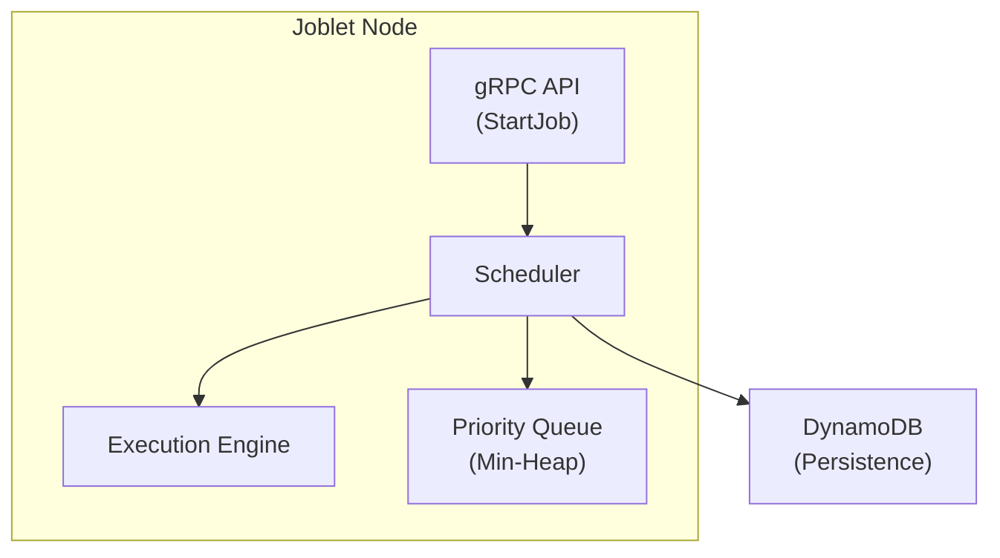
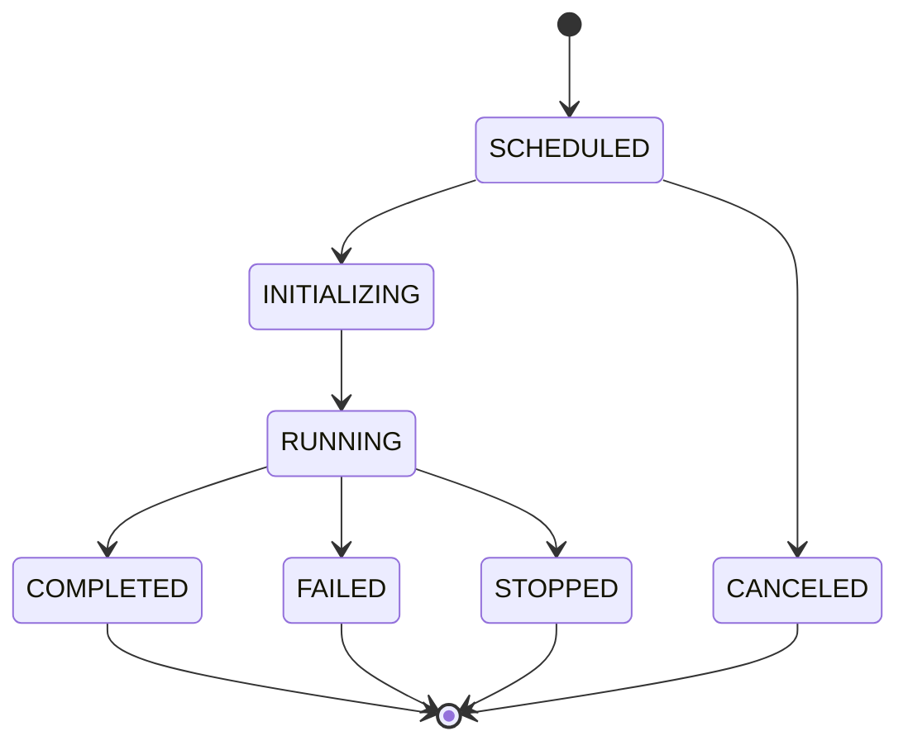
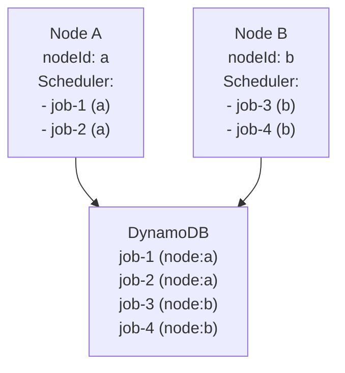

# Job Scheduling

This document provides comprehensive information about Joblet's job scheduling system, including how to schedule jobs
for future execution, architecture details, multi-node behavior, and persistence across restarts.

## Document Structure

- [Overview](#overview)
- [Scheduling Jobs](#scheduling-jobs)
- [Architecture](#architecture)
- [Multi-Node Deployments](#multi-node-deployments)
- [Persistence and Recovery](#persistence-and-recovery)
- [Monitoring Scheduled Jobs](#monitoring-scheduled-jobs)
- [Canceling Scheduled Jobs](#canceling-scheduled-jobs)
- [Limitations](#limitations)
- [Best Practices](#best-practices)
- [Troubleshooting](#troubleshooting)

## Overview

Joblet supports scheduling jobs for future execution using RFC3339 timestamps. Scheduled jobs are:

- **Persisted** to DynamoDB for durability across restarts
- **Node-specific** - each job runs only on the node that created it
- **Automatically recovered** when a node restarts
- **Executed immediately** if their scheduled time has passed during downtime

### Key Characteristics

| Feature | Behavior |
|---------|----------|
| Time Format | RFC3339 (e.g., `2025-01-15T10:30:00Z`) |
| Timezone | UTC recommended, local time supported |
| Persistence | DynamoDB (survives restarts) |
| Node Affinity | Jobs execute on creating node only |
| Overdue Jobs | Execute immediately on recovery |

## Scheduling Jobs

### Basic Scheduling

Use the `--schedule` flag to schedule a job for future execution:

```bash
# Schedule for a specific time (UTC)
rnx job run --schedule="2025-01-15T10:30:00Z" python3 process_data.py

# Schedule for a specific time with timezone offset
rnx job run --schedule="2025-01-15T10:30:00-05:00" ./backup.sh

# Schedule with resource limits
rnx job run --schedule="2025-01-15T14:00:00Z" \
    --max-cpu=50 \
    --max-memory=512 \
    python3 heavy_computation.py
```

### Schedule Format

The schedule parameter must be in RFC3339 format:

```text
YYYY-MM-DDTHH:MM:SSZ          # UTC time
YYYY-MM-DDTHH:MM:SS+HH:MM     # With positive offset
YYYY-MM-DDTHH:MM:SS-HH:MM     # With negative offset
```

**Examples:**

```bash
# UTC time
--schedule="2025-06-15T09:00:00Z"

# US Eastern (EST, -5 hours)
--schedule="2025-06-15T09:00:00-05:00"

# Central European (CET, +1 hour)
--schedule="2025-06-15T09:00:00+01:00"
```

### Scheduling with File Uploads

Scheduled jobs support file uploads. Files are staged immediately and stored until execution:

```bash
# Schedule job with file upload
rnx job run --schedule="2025-01-15T10:00:00Z" \
    --upload=./data.csv:/workspace/data.csv \
    python3 /workspace/process.py

# Multiple files
rnx job run --schedule="2025-01-15T10:00:00Z" \
    --upload=./config.yaml:/app/config.yaml \
    --upload=./script.py:/app/script.py \
    python3 /app/script.py
```

### Response

When a job is scheduled, you receive confirmation with the job ID:

```json
{
  "uuid": "job-abc123-def456",
  "status": "SCHEDULED",
  "scheduledTime": "2025-01-15T10:30:00Z",
  "nodeId": "node-prod-1"
}
```

## Architecture

### Components



### Scheduler Design

The scheduler uses a **sleep-until-next** strategy for efficient CPU usage:

1. **Priority Queue**: Jobs ordered by scheduled time (min-heap)
2. **Sleep Strategy**: Sleeps until next job is due (no polling)
3. **Wake-on-Insert**: Wakes immediately when earlier job is added
4. **Graceful Shutdown**: Respects stop signals during sleep

### Job States



| Status | Description |
|--------|-------------|
| `SCHEDULED` | Job queued for future execution |
| `INITIALIZING` | Job starting (setting up resources) |
| `RUNNING` | Job actively executing |
| `COMPLETED` | Job finished successfully |
| `FAILED` | Job exited with error |
| `STOPPED` | Job manually stopped |
| `CANCELED` | Scheduled job removed before execution |

## Multi-Node Deployments

### Node Affinity

In multi-node deployments sharing a DynamoDB table, **scheduled jobs are node-specific**:



**Behavior:**

- Job scheduled on Node A → `NodeId = "node-a"` → Only Node A executes it
- Node B restarts → Loads all jobs → Filters to `NodeId = "node-b"` → Ignores Node A's jobs
- **No duplicate execution** across nodes

### Configuration

Each node must have a unique `nodeId` in its configuration:

```yaml
# /opt/joblet/config/joblet-config.yml
server:
  address: "0.0.0.0"
  port: 50051
  nodeId: "node-prod-1"  # Must be unique per node
```

### Important Considerations

**If a node goes down permanently:**

- Its scheduled jobs will **NOT** be executed by other nodes
- Jobs remain in DynamoDB with `SCHEDULED` status
- Manual intervention required to reassign or cancel jobs

This is a deliberate design choice. Future orchestration layers may add:
- Leader election for scheduler master
- Job reassignment on node failure
- Distributed locking mechanisms

## Persistence and Recovery

### How Persistence Works

1. **Job Creation**: Job stored in DynamoDB with `status=SCHEDULED`
2. **In-Memory Queue**: Job added to scheduler's priority queue
3. **Execution**: Job removed from queue, status → `RUNNING`
4. **Completion**: Status updated to `COMPLETED`/`FAILED`

### Recovery on Restart

When a Joblet node restarts:

```text
1. Start Joblet
2. SyncFromPersistentState() → Load ALL jobs from DynamoDB
3. RecoverScheduledJobs() → Filter for:
   - status == SCHEDULED
   - nodeId == current node's ID
4. Add matching jobs to scheduler queue
5. Execute overdue jobs immediately
```

**Log output during recovery:**

```text
[INFO] recovering scheduled jobs from persistent storage totalJobs=15 nodeId=node-prod-1
[INFO] scheduled job is overdue, will execute immediately job_uuid=job-abc123 overdueBy=5m30s
[DEBUG] recovered scheduled job job_uuid=job-def456 scheduledTime=2025-01-15T10:30:00Z
[INFO] scheduled job recovery completed recovered=3 skipped=0 nodeId=node-prod-1
```

### Overdue Job Handling

Jobs whose scheduled time passed during downtime execute immediately:

| Scheduled Time | Node Down | Node Up | Behavior |
|----------------|-----------|---------|----------|
| 10:00 | 09:55 | 10:15 | Executes at 10:15 (15 min overdue) |
| 10:00 | 09:55 | 09:58 | Executes at 10:00 (on time) |

## Monitoring Scheduled Jobs

### List Scheduled Jobs

```bash
# List all jobs (includes scheduled)
rnx job list

# Filter by status
rnx job list --status=SCHEDULED

# JSON output for scripting
rnx job list --status=SCHEDULED --json
```

### View Scheduled Job Details

```bash
# Get job details
rnx job status <job-id>

# Example output
Job ID:     job-abc123-def456
Status:     SCHEDULED
Command:    python3 process_data.py
Scheduled:  2025-01-15T10:30:00Z (in 2h 15m)
Node:       node-prod-1
```

### gRPC API

```protobuf
// List scheduled jobs
rpc ListJobs(ListJobsRequest) returns (ListJobsResponse);

message ListJobsRequest {
  string status_filter = 1;  // "SCHEDULED"
}
```

## Canceling Scheduled Jobs

### Cancel Before Execution

```bash
# Cancel a scheduled job
rnx job stop <job-id>

# Force cancel (if stuck)
rnx job stop --force <job-id>
```

**Result:**
- Job removed from scheduler queue
- Status changed to `CANCELED`
- Pre-staged uploads cleaned up

### Delete Scheduled Job

```bash
# Delete job and its data
rnx job delete <job-id>
```

## Limitations

### Current Limitations

| Limitation | Description | Workaround |
|------------|-------------|------------|
| No recurring schedules | Single execution only | External cron + API calls |
| Node-specific | Jobs tied to creating node | Design for node affinity |
| No distributed locking | No cross-node coordination | Future orchestration layer |
| In-memory queue | Queue rebuilt on restart | Persistent storage ensures durability |

### Not Supported

- **Cron expressions** (e.g., `0 */2 * * *`)
- **Relative scheduling** (e.g., "5 minutes from now")
- **Job dependencies** (e.g., "run after job X completes")
- **Cross-node execution** (jobs only run on creating node)

### Future Enhancements

Planned features for future releases:

1. **Cron-style recurring schedules**
2. **Cross-node job reassignment** on failure

> Job dependencies and multi-job orchestration are intentionally out of scope for the executor — they are handled by a
> separate workflow-orchestration project that builds on joblet's Job API (see
> [ADR-013](adr/013-extract-workflow-to-separate-project.md)).

## Best Practices

### Time Specification

```bash
# GOOD: Use UTC for consistency
rnx job run --schedule="2025-01-15T10:00:00Z" ./script.sh

# GOOD: Explicit timezone if needed
rnx job run --schedule="2025-01-15T10:00:00-05:00" ./script.sh

# AVOID: Ambiguous local time (depends on server timezone)
```

### Resource Planning

```bash
# Set appropriate resource limits for scheduled jobs
rnx job run --schedule="2025-01-15T02:00:00Z" \
    --max-cpu=80 \
    --max-memory=2048 \
    --max-io=50 \
    ./nightly_backup.sh
```

### Monitoring

- Monitor `SCHEDULED` job count via metrics
- Set up alerts for jobs stuck in `SCHEDULED` state
- Review logs for recovery events after restarts

### Multi-Node Deployments

- Ensure unique `nodeId` for each node
- Consider which node should run scheduled jobs
- Plan for node failure scenarios

## Troubleshooting

### Job Not Executing at Scheduled Time

**Symptoms:** Job remains in `SCHEDULED` status past its scheduled time.

**Checks:**
1. Verify node is running: `systemctl status joblet`
2. Check scheduler logs: `journalctl -u joblet | grep scheduler`
3. Verify job's `nodeId` matches current node

### Jobs Not Recovered After Restart

**Symptoms:** Scheduled jobs missing after node restart.

**Checks:**
1. Verify DynamoDB connectivity
2. Check `SyncFromPersistentState` logs
3. Confirm `nodeId` hasn't changed

```bash
# Check recovery logs
journalctl -u joblet | grep -E "(recovering|recovered)"
```

### Duplicate Job Execution

**Symptoms:** Same job running on multiple nodes.

**Cause:** Likely `nodeId` configuration issue.

**Fix:**
1. Ensure each node has unique `nodeId`
2. Restart affected nodes
3. Check job's `nodeId` field

### Scheduled Time in the Past

**Behavior:** Jobs scheduled for past times execute immediately.

```bash
# This will execute immediately
rnx job run --schedule="2020-01-01T00:00:00Z" echo "runs now"
```

### Common Error Messages

| Error | Cause | Solution |
|-------|-------|----------|
| `invalid schedule format` | Non-RFC3339 timestamp | Use `YYYY-MM-DDTHH:MM:SSZ` format |
| `job not found` | Job deleted or wrong ID | Verify job ID with `rnx job list` |
| `state client not available` | DynamoDB connection issue | Check state service logs |

## Related Documentation

- [Job Execution Guide](JOB_EXECUTION.md) - General job execution
- [State Persistence](STATE_PERSISTENCE.md) - DynamoDB configuration
- [Configuration](CONFIGURATION.md) - Node ID and server settings
- [Monitoring](MONITORING.md) - Metrics and observability
