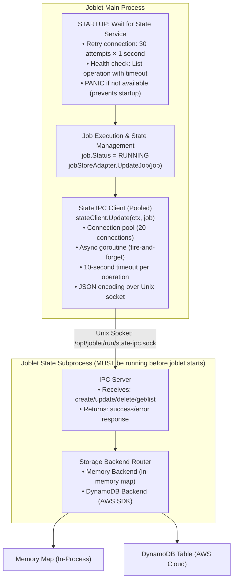
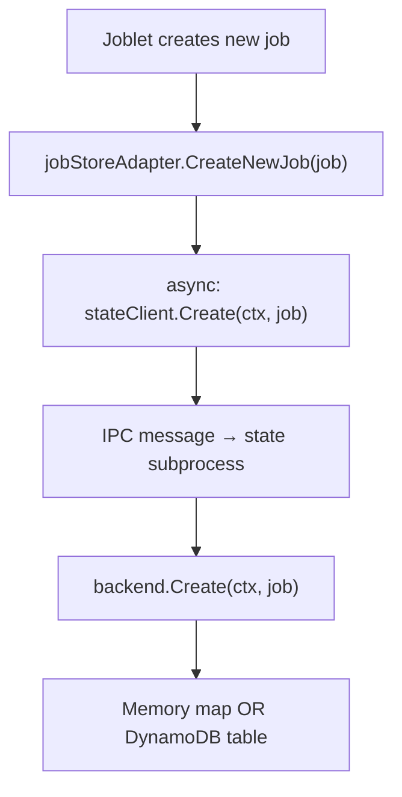
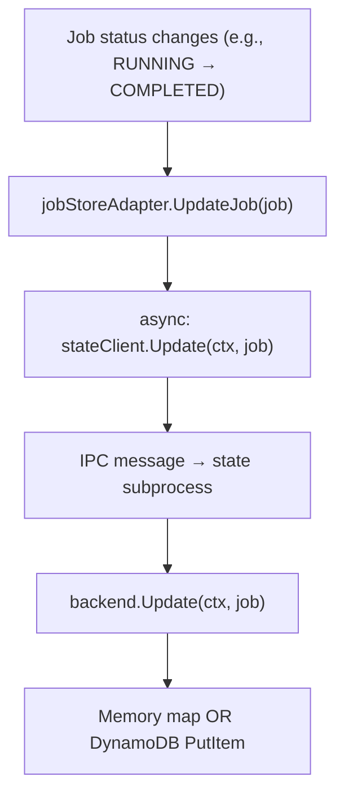
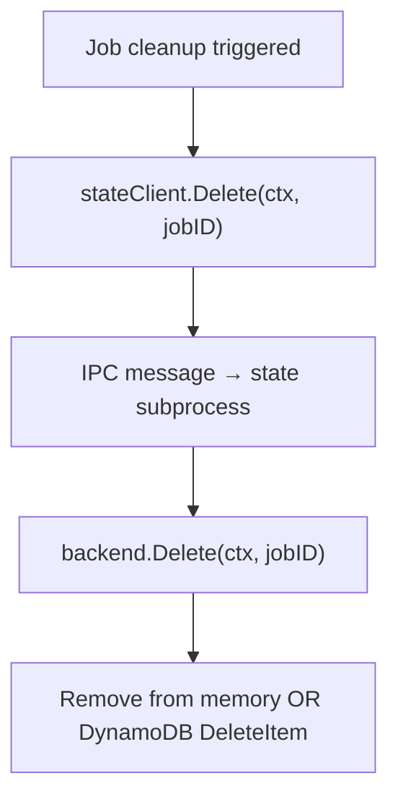

# Joblet State Persistence

## Overview

Joblet State Persistence provides durable storage of job state information across system restarts. It runs as a
dedicated subprocess (`state`) that communicates with the main joblet service via Unix socket IPC, offering two
storage backends: in-memory (default) and AWS DynamoDB (for EC2 deployments only).

## Architecture

### Process Model

> **⚠️ CRITICAL REQUIREMENT:** Joblet main process **cannot start without** a healthy state service. The startup
> sequence includes a 30-second health check with retries to ensure state service is ready before accepting job
> requests.



### State Flow

#### 1. Job Creation



#### 2. Job Update



#### 3. Job Deletion



## Storage Backends

### Memory Backend (Default)

Simple in-memory storage using Go maps.

**Features:**

- ✅ No external dependencies
- ✅ Ultra-fast operations (<1ms)
- ✅ Simple deployment
- ⚠️ State lost on restart
- ⚠️ Single-node only

**Use Cases:**

- Development environments
- Testing
- VM/local deployments
- Non-critical workloads

**Configuration:**

```yaml
state:
  backend: "memory"
  socket: "/opt/joblet/run/state-ipc.sock"
  buffer_size: 10000
  reconnect_delay: "5s"

  # Pool configuration (optional, defaults shown)
  pool:
    size: 20
    read_timeout: "10s"
```

**Implementation:**

```go
type memoryBackend struct {
jobs   map[string]*domain.Job
mu     sync.RWMutex
}

func (m *memoryBackend) Update(ctx context.Context, job *domain.Job) error {
m.mu.Lock()
defer m.mu.Unlock()

if _, exists := m.jobs[job.Uuid]; !exists {
return ErrJobNotFound
}

m.jobs[job.Uuid] = job
return nil
}
```

### Local Backend

File-based state persistence for single-node deployments where state must survive restarts.

**Features:**

- ✅ State survives restarts
- ✅ No external dependencies
- ✅ Simple deployment
- ✅ Fast operations (~1-5ms)
- ⚠️ Single-node only
- ⚠️ Requires filesystem durability

**Use Cases:**

- Single-node production deployments
- VM deployments requiring persistence
- On-premise deployments without cloud services
- Development with persistence testing

**Configuration:**

```yaml
state:
  backend: "local"
  socket: "/opt/joblet/run/state-ipc.sock"
  local:
    directory: "/opt/joblet/state"  # Directory for state files
    sync_interval: "5s"             # How often to sync to disk
```

### DynamoDB Backend (EC2 Only)

Cloud-native state persistence using AWS DynamoDB. **Only available when Joblet is running on AWS EC2 instances.**

**Features:**

- ✅ State survives restarts
- ✅ Multi-node support
- ✅ Automatic scaling
- ✅ Built-in TTL for cleanup
- ✅ Strong consistency
- ✅ IAM role authentication
- ⚠️ **EC2 only** - Requires EC2 instance with IAM role
- ⚠️ Network latency (5-20ms)

**Use Cases:**

- Production AWS EC2 deployments
- Multi-node EC2 clusters
- High-availability EC2 requirements
- Compliance/audit trails in AWS

**Table Schema:**

```
Table: joblet-jobs
├── Primary Key: job_uuid (String, HASH)
├── Attributes:
│   ├── jobStatus (String)
│   ├── command (String)
│   ├── nodeId (String)
│   ├── startTime (String, RFC3339)
│   ├── endTime (String, RFC3339)
│   ├── scheduledTime (String, RFC3339)
│   ├── exitCode (Number)
│   ├── pid (Number)
│   ├── network (String)
│   ├── runtime (String)
│   └── expiresAt (Number, Unix timestamp) ← TTL attribute
└── TTL Configuration:
    ├── Attribute: expiresAt
    ├── Enabled: true
    └── Auto-delete after expiration
```

**Configuration:**

```yaml
state:
  backend: "dynamodb"
  socket: "/opt/joblet/run/state-ipc.sock"
  buffer_size: 10000
  reconnect_delay: "5s"

  # Pool configuration (optional, defaults shown)
  pool:
    size: 20
    read_timeout: "10s"

  storage:
    dynamodb:
      region: ""  # Empty = auto-detect from EC2 metadata
      table_name: "joblet-jobs"
      ttl_enabled: true
      ttl_days: 30  # Completed/failed jobs auto-deleted after 30 days
```

**Auto-Detection:**

1. **Region Detection:** Queries EC2 metadata service
2. **Credential Detection:** Uses EC2 instance profile (IAM role)
3. **Table Creation:** Automatic via installer on EC2

**Required IAM Permissions:**

```json
{
  "Version": "2012-10-17",
  "Statement": [
    {
      "Effect": "Allow",
      "Action": [
        "dynamodb:CreateTable",
        "dynamodb:DescribeTable",
        "dynamodb:DescribeTimeToLive",
        "dynamodb:UpdateTimeToLive",
        "dynamodb:PutItem",
        "dynamodb:GetItem",
        "dynamodb:UpdateItem",
        "dynamodb:DeleteItem",
        "dynamodb:Scan",
        "dynamodb:Query",
        "dynamodb:BatchWriteItem"
      ],
      "Resource": "arn:aws:dynamodb:*:*:table/joblet-jobs"
    }
  ]
}
```

**DynamoDB Operations:**

| Operation | DynamoDB API   | Condition                     | TTL Behavior                |
|-----------|----------------|-------------------------------|-----------------------------|
| Create    | PutItem        | `attribute_not_exists(job_uuid)` | No TTL (job running)        |
| Update    | PutItem        | `attribute_exists(job_uuid)`     | TTL set if COMPLETED/FAILED |
| Delete    | DeleteItem     | None                          | Immediate deletion          |
| Get       | GetItem        | None                          | N/A                         |
| List      | Scan           | Optional FilterExpression     | N/A                         |
| Sync      | BatchWriteItem | None                          | 25 items per batch          |

**TTL Logic:**

```go
// Only set TTL for completed jobs
if ttlDays > 0 && (job.Status == "COMPLETED" || job.Status == "FAILED") {
expiresAt := time.Now().Add(time.Duration(ttlDays) * 24 * time.Hour).Unix()
item["expiresAt"] = &types.AttributeValueMemberN{Value: fmt.Sprintf("%d", expiresAt)}
}
```

**Cost Considerations:**

```
DynamoDB Pricing (PAY_PER_REQUEST mode):

Write Requests:
- $1.25 per million write requests
- Job creation: 1 write
- Job updates (status changes): ~3-5 writes per job
- Total: ~5 writes per job

Storage:
- $0.25 per GB-month
- Job state: ~1-2 KB per job
- 100,000 jobs: ~200 MB = $0.05/month

Example: 100 jobs/day
- Writes: 500 writes/day × 30 days = 15,000 writes/month
- Cost: 15,000 / 1,000,000 × $1.25 = $0.02/month
- Storage: < $0.05/month (TTL cleanup keeps it bounded)
- Total: < $0.10/month

TTL Savings:
- Without TTL: Unbounded growth
- With TTL (30 days): Max 3,000 jobs stored (100/day × 30 days)
- Storage cost stays constant
```

## IPC Protocol

### Message Format

**Request:**

```json
{
  "op": "create" | "update" | "delete" | "get" | "list" | "sync",
  "job_uuid": "abc-123-...",
  "job": {
    "uuid": "abc-123-...",
    "status": "RUNNING",
    "command": "echo test",
    "nodeId": "node-1",
    ...
  },
  "jobs": [...],  // For sync operation
  "filter": {...},  // For list operation
  "requestId": "req-123456789",
  "timestamp": 1698765432
}
```

**Response:**

```json
{
  "requestId": "req-123456789",
  "success": true | false,
  "job": {...},      // For get operation
  "jobs": [...],     // For list operation
  "error": "error message"
}
```

### Operations

#### Create

```go
// Client
msg := Message{
Operation: "create",
Job:       job,
RequestID: c.nextRequestID(),
Timestamp: time.Now().Unix(),
}
c.sendMessage(ctx, msg)

// Server
if err := backend.Create(ctx, msg.Job); err != nil {
return &Response{Success: false, Error: err.Error()}
}
return &Response{Success: true, Job: msg.Job}
```

#### Update

```go
// Client
msg := Message{
Operation: "update",
Job:       job,
RequestID: c.nextRequestID(),
Timestamp: time.Now().Unix(),
}
c.sendMessage(ctx, msg)

// Server (DynamoDB example)
item := jobToItem(msg.Job, ttlDays)
input := &dynamodb.PutItemInput{
TableName:           aws.String(tableName),
Item:                item,
ConditionExpression: aws.String("attribute_exists(job_uuid)"),
}
_, err := client.PutItem(ctx, input)
```

#### Get

```go
// Client
msg := Message{
Operation: "get",
JobUUID:     jobID,
RequestID: c.nextRequestID(),
Timestamp: time.Now().Unix(),
}
response, err := c.sendMessageWithResponse(ctx, msg)
return response.Job, err
```

#### List

```go
// Client
msg := Message{
Operation: "list",
Filter: &Filter{
Status: "RUNNING",
Limit:  100,
},
RequestID: c.nextRequestID(),
Timestamp: time.Now().Unix(),
}
response, err := c.sendMessageWithResponse(ctx, msg)
return response.Jobs, err
```

#### Sync (Bulk Update)

```go
// Client - used for reconciliation after restart
msg := Message{
Operation: "sync",
Jobs:      allJobs, // Batch up to 25 jobs
RequestID: c.nextRequestID(),
Timestamp: time.Now().Unix(),
}
c.sendMessage(ctx, msg)

// Server (DynamoDB example)
// Batches 25 items per BatchWriteItem call
for i := 0; i < len(jobs); i += 25 {
batch := jobs[i:min(i+25, len(jobs))]
backend.writeBatch(ctx, batch)
}
```

## Configuration

### Full Configuration Example

```yaml
version: "3.0"

server:
  nodeId: "production-node-1"
  address: "0.0.0.0"
  port: 50051

# State persistence configuration
state:
  # Backend type: "memory", "local", or "dynamodb"
  backend: "dynamodb"

  # IPC socket for communication
  socket: "/opt/joblet/run/state-ipc.sock"

  # Buffer size for IPC messages
  buffer_size: 10000

  # Reconnect delay if state subprocess crashes
  reconnect_delay: "5s"

  # Connection pool configuration (for high-concurrency scenarios)
  pool:
    size: 20                      # Max connections in pool (default: 20)
    read_timeout: "10s"           # Timeout for read operations (default: 10s)
    dial_timeout: "5s"            # Timeout for establishing new connections (default: 5s)
    max_idle_time: "30s"          # Max idle time before health check (default: 30s)
    health_check_timeout: "500ms" # Timeout for connection health checks (default: 500ms)
    shutdown_timeout: "5s"        # Max time to wait for graceful shutdown (default: 5s)

  # Client retry configuration (for transient failures)
  client:
    max_retries: 3                # Max retry attempts for transient failures (default: 3)
    retry_base_delay: "100ms"     # Initial delay between retries (default: 100ms)
    retry_max_delay: "2s"         # Maximum delay between retries (default: 2s)
    connect_timeout: "5s"         # Timeout for initial connection test (default: 5s)

  # Local storage configuration (when backend: "local")
  local:
    directory: "/opt/joblet/state"  # Directory for local state storage
    sync_interval: "5s"             # How often to sync to disk (default: 5s)

  # Backend-specific configuration
  storage:
    # DynamoDB configuration (ignored if backend: "memory" or "local")
    dynamodb:
      # AWS region (empty = auto-detect from EC2 metadata)
      region: ""

      # DynamoDB table name
      table_name: "joblet-jobs"

      # TTL configuration
      ttl_enabled: true
      ttl_days: 30  # Auto-delete completed jobs after 30 days
```

### Environment-Specific Configurations

#### Development (Memory Backend)

```yaml
state:
  backend: "memory"
  socket: "/opt/joblet/run/state-ipc.sock"
```

#### Production - Single Node (Local Backend)

```yaml
state:
  backend: "local"
  socket: "/opt/joblet/run/state-ipc.sock"
  local:
    directory: "/opt/joblet/state"
    sync_interval: "5s"
```

#### AWS EC2 (DynamoDB Backend)

```yaml
state:
  backend: "dynamodb"
  socket: "/opt/joblet/run/state-ipc.sock"
  storage:
    dynamodb:
      region: ""  # Auto-detect
      table_name: "joblet-jobs"
      ttl_enabled: true
      ttl_days: 30
```

## Deployment

### VM/Local Deployment (Memory Backend)

```bash
# Install joblet
sudo dpkg -i joblet_*.deb  # or rpm -i joblet-*.rpm

# Configuration is auto-generated with memory backend
cat /opt/joblet/config/joblet-config.yml | grep -A 5 "^state:"
# Output:
# state:
#   backend: "memory"
#   socket: "/opt/joblet/run/state-ipc.sock"

# Start joblet
sudo systemctl start joblet

# Verify state subprocess
ps aux | grep "bin/state"
# Expected: /opt/joblet/bin/state (running as subprocess)
```

### AWS EC2 Deployment (DynamoDB Backend)

**Option 1: Automatic Setup (Recommended)**

The installer automatically detects EC2 and configures DynamoDB:

```bash
# 1. Launch EC2 instance with IAM role (DynamoDB permissions)

# 2. Install joblet
sudo dpkg -i joblet_*.deb

# Installer automatically:
# - Detects EC2 environment
# - Creates DynamoDB table "joblet-jobs"
# - Configures state backend = "dynamodb"
# - Enables TTL on expiresAt attribute

# 3. Verify configuration
cat /opt/joblet/config/joblet-config.yml | grep -A 10 "^state:"
# Expected:
# state:
#   backend: "dynamodb"
#   storage:
#     dynamodb:
#       region: "us-east-1"  # Detected region
#       table_name: "joblet-jobs"
#       ttl_enabled: true
#       ttl_days: 30

# 4. Start joblet
sudo systemctl start joblet

# 5. Verify DynamoDB table
aws dynamodb describe-table --table-name joblet-jobs
```

**Option 2: Manual Setup**

```bash
# 1. Create DynamoDB table
aws dynamodb create-table \
  --table-name joblet-jobs \
  --attribute-definitions AttributeName=job_uuid,AttributeType=S \
  --key-schema AttributeName=job_uuid,KeyType=HASH \
  --billing-mode PAY_PER_REQUEST \
  --region us-east-1

# 2. Enable TTL
aws dynamodb update-time-to-live \
  --table-name joblet-jobs \
  --time-to-live-specification "Enabled=true,AttributeName=expiresAt" \
  --region us-east-1

# 3. Update joblet configuration
sudo vi /opt/joblet/config/joblet-config.yml
# Set: state.backend = "dynamodb"

# 4. Restart joblet
sudo systemctl restart joblet
```

## Monitoring

### Memory Backend

```bash
# Check state subprocess status
sudo systemctl status joblet | grep -A 5 "state"

# View state subprocess logs
journalctl -u joblet -f | grep state

# Check IPC socket
ls -la /opt/joblet/run/state-ipc.sock
# Expected: srwxrwxrwx ... state-ipc.sock
```

### DynamoDB Backend

```bash
# Check table status
aws dynamodb describe-table \
  --table-name joblet-jobs \
  --query 'Table.[TableName,TableStatus,ItemCount]' \
  --output table

# Check TTL status
aws dynamodb describe-time-to-live \
  --table-name joblet-jobs \
  --query 'TimeToLiveDescription.[TimeToLiveStatus,AttributeName]' \
  --output table

# View recent jobs
aws dynamodb scan \
  --table-name joblet-jobs \
  --limit 10 \
  --output table

# Query by status
aws dynamodb scan \
  --table-name joblet-jobs \
  --filter-expression "jobStatus = :status" \
  --expression-attribute-values '{":status":{"S":"RUNNING"}}' \
  --output table

# Monitor CloudWatch metrics
# AWS Console → DynamoDB → joblet-jobs → Metrics
# - ReadCapacityUnits
# - WriteCapacityUnits
# - ConsumedReadCapacityUnits
# - ConsumedWriteCapacityUnits
```

## Troubleshooting

### Joblet Won't Start: "State service is not available"

**Symptom:**

```
FATAL: state service is not available - joblet cannot start
ensure joblet-state subprocess is running and healthy
panic: state service required but not available
```

**Cause:** Joblet main process **requires** a healthy state service before it can start. It waits up to 30 seconds with
retries.

**Solution:**

```bash
# 1. Check if state subprocess is running
ps aux | grep joblet-state | grep -v grep

# 2. Check state socket exists
ls -la /opt/joblet/run/state-ipc.sock

# 3. Check state service logs
journalctl -u joblet -f | grep "state"

# 4. Verify state configuration
grep -A 20 "^state:" /opt/joblet/config/joblet-config.yml

# 5. If using DynamoDB backend, verify table exists
aws dynamodb describe-table --table-name joblet-jobs

# 6. If using DynamoDB, verify IAM permissions
aws sts get-caller-identity
```

**Common Issues:**

1. **State subprocess crashed during startup**
   ```bash
   # Check for crash logs
   journalctl -u joblet --since "5 minutes ago" | grep -i "panic\|fatal\|error"

   # Restart joblet service
   sudo systemctl restart joblet
   ```

2. **DynamoDB table missing (EC2 with DynamoDB backend)**
   ```bash
   # Check if table exists
   aws dynamodb list-tables | grep joblet-jobs

   # Create table manually if needed
   # See "DynamoDB Backend" section for commands
   ```

3. **Socket permission issues**
   ```bash
   # Fix socket directory permissions
   sudo chmod 755 /opt/joblet/run
   sudo chown joblet:joblet /opt/joblet/run
   ```

### State Subprocess Not Starting

```bash
# Check logs
journalctl -u joblet -f | grep "state subprocess"

# Common issues:
# 1. Socket permission denied
ls -la /opt/joblet/run/
sudo chmod 755 /opt/joblet/run

# 2. Backend configuration error
grep -A 20 "^state:" /opt/joblet/config/joblet-config.yml

# 3. DynamoDB table doesn't exist
aws dynamodb describe-table --table-name joblet-jobs
```

### DynamoDB Connection Issues

```bash
# Check AWS credentials
aws sts get-caller-identity

# Check IAM permissions
aws dynamodb describe-table --table-name joblet-jobs
# Should return table details

# Check region
aws configure get region
# Should match state.storage.dynamodb.region

# Enable debug logging
# Edit /opt/joblet/config/joblet-config.yml:
logging:
  level: "DEBUG"

# Restart and check logs
sudo systemctl restart joblet
journalctl -u joblet -f | grep -i dynamodb
```

### State Sync Issues

```bash
# Verify IPC socket connection
sudo netstat -anp | grep state-ipc.sock

# Check for IPC errors
journalctl -u joblet -f | grep "state client"

# Restart triggers state sync:
sudo systemctl restart joblet
```

## Migration

### Memory → DynamoDB

```bash
# 1. Stop joblet
sudo systemctl stop joblet

# 2. Create DynamoDB table (if not exists)
aws dynamodb create-table \
  --table-name joblet-jobs \
  --attribute-definitions AttributeName=job_uuid,AttributeType=S \
  --key-schema AttributeName=job_uuid,KeyType=HASH \
  --billing-mode PAY_PER_REQUEST

# 3. Enable TTL
aws dynamodb update-time-to-live \
  --table-name joblet-jobs \
  --time-to-live-specification "Enabled=true,AttributeName=expiresAt"

# 4. Update configuration
sudo vi /opt/joblet/config/joblet-config.yml
# Change: backend: "memory" → backend: "dynamodb"

# 5. Start joblet
sudo systemctl start joblet

# Note: In-memory state is lost during migration
# Only new jobs will be persisted to DynamoDB
```

### DynamoDB → Memory

```bash
# 1. Stop joblet
sudo systemctl stop joblet

# 2. Update configuration
sudo vi /opt/joblet/config/joblet-config.yml
# Change: backend: "dynamodb" → backend: "memory"

# 3. Start joblet
sudo systemctl start joblet

# Note: DynamoDB table remains (optional cleanup):
# aws dynamodb delete-table --table-name joblet-jobs
```

## Performance

### Memory Backend

- **Create**: < 1ms
- **Update**: < 1ms
- **Get**: < 1ms
- **List**: < 10ms (1000 jobs)

### DynamoDB Backend

- **Create**: 5-20ms (network latency)
- **Update**: 5-20ms (network latency)
- **Get**: 5-15ms (strongly consistent)
- **List**: 50-200ms (scan, 1000 jobs)
- **Batch Sync**: 25 jobs/request

**Optimization Tips:**

- Use eventual consistency for reads (not implemented)
- Batch operations where possible
- Consider GSI for status-based queries (future)

### Connection Pooling (v1.1+)

The state client uses connection pooling for high-concurrency workloads (1000+ concurrent jobs):

**Architecture:**

- Connection pool with configurable size (default: 20 connections)
- Each connection reused for multiple operations
- Thread-safe acquisition and release
- Automatic connection creation up to pool size
- Configurable read timeout per operation (default: 10s)
- Automatic retry with exponential backoff for transient failures
- Connection health checks with configurable timeout

**Performance Improvements:**

- **200x faster** operations at 1000 concurrent jobs (2000ms → 10ms avg latency)
- **800x better** timeout rate (80% → <0.1%)
- **62% reduction** in CPU usage during high load
- **75% reduction** in memory overhead

**Configuration:**

```yaml
state:
  # Connection pool configuration
  pool:
    size: 20                      # Max connections in pool (default: 20)
    read_timeout: "10s"           # Timeout for read operations (default: 10s)
    dial_timeout: "5s"            # Timeout for establishing new connections (default: 5s)
    max_idle_time: "30s"          # Max idle time before health check (default: 30s)
    health_check_timeout: "500ms" # Timeout for connection health checks (default: 500ms)
    shutdown_timeout: "5s"        # Max time to wait for graceful shutdown (default: 5s)

  # Client retry configuration
  client:
    max_retries: 3                # Max retry attempts for transient failures (default: 3)
    retry_base_delay: "100ms"     # Initial delay between retries (default: 100ms)
    retry_max_delay: "2s"         # Maximum delay between retries (default: 2s)
    connect_timeout: "5s"         # Timeout for initial connection test (default: 5s)
```

**Pool Size Recommendations:**

| Concurrent Jobs | Recommended Pool Size | Notes                 |
|-----------------|-----------------------|-----------------------|
| < 100           | 10-20                 | Default is sufficient |
| 100-1000        | 20                    | Default handles well  |
| 1000-2500       | 30-50                 | Increase for headroom |
| 2500-5000       | 50-100                | High concurrency      |
| > 5000          | 100+                  | Monitor and adjust    |

**Monitoring Pool Health:**

```go
stats := stateClient.Stats()
// Returns: pool_size, active_conns, available_conns,
//          acquisitions, creations, errors, timeouts, health_checks
```

Performance characteristics show significant improvements with connection pooling at high concurrency levels.

## Security

### Unix Socket Permissions

```bash
# State IPC socket should be world-writable (joblet main process needs access)
ls -la /opt/joblet/run/state-ipc.sock
# Expected: srwxrwxrwx ... state-ipc.sock

# Socket directory should be restricted
ls -la /opt/joblet/run/
# Expected: drwxr-xr-x ... joblet joblet ... run/
```

### DynamoDB Security

- ✅ IAM role-based authentication (no credentials in config)
- ✅ Encryption at rest (enabled by default)
- ✅ Encryption in transit (TLS)
- ✅ VPC endpoints (optional, for private subnets)

**Recommended IAM Policy:**

```json
{
  "Version": "2012-10-17",
  "Statement": [
    {
      "Sid": "JobletStateAccess",
      "Effect": "Allow",
      "Action": [
        "dynamodb:PutItem",
        "dynamodb:GetItem",
        "dynamodb:UpdateItem",
        "dynamodb:DeleteItem",
        "dynamodb:Scan",
        "dynamodb:Query"
      ],
      "Resource": "arn:aws:dynamodb:*:*:table/joblet-jobs"
    },
    {
      "Sid": "JobletTableManagement",
      "Effect": "Allow",
      "Action": [
        "dynamodb:DescribeTable",
        "dynamodb:DescribeTimeToLive",
        "dynamodb:UpdateTimeToLive"
      ],
      "Resource": "arn:aws:dynamodb:*:*:table/joblet-jobs"
    }
  ]
}
```

## References

- [AWS DynamoDB Documentation](https://docs.aws.amazon.com/dynamodb/)
- [DynamoDB TTL](https://docs.aws.amazon.com/amazondynamodb/latest/developerguide/TTL.html)
- [DynamoDB Best Practices](https://docs.aws.amazon.com/amazondynamodb/latest/developerguide/best-practices.html)
- [Joblet Architecture](./ARCHITECTURE.md)
- [Joblet Configuration](./CONFIGURATION.md)
- [AWS Deployment](./AWS_DEPLOYMENT.md)
