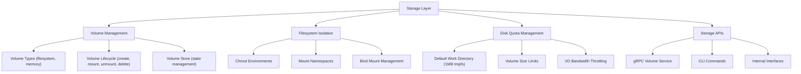

# Joblet Storage Layer Design

## Overview

The Joblet storage layer provides a comprehensive solution for managing persistent and temporary storage in isolated job
environments. It supports multiple storage backends, enforces disk quotas, and ensures complete isolation between jobs
while maintaining performance and security.

## Architecture

### Core Components



## Volume Management

### Volume Types

#### 1. Filesystem Volumes

- **Purpose**: Persistent storage that survives job restarts and system reboots
- **Implementation**: Loop-mounted ext4 image (backing file) for size enforcement, with a plain-directory fallback if
  loop setup fails
- **Location**: `/opt/joblet/volumes/<name>/data` (keyed by volume name)
- **Features**:
    - Persistent across job executions
    - Survives daemon restarts
    - Suitable for data processing workflows
    - Backed by host filesystem (ext4, xfs, etc.)

#### 2. Memory Volumes

- **Purpose**: High-performance temporary storage
- **Implementation**: tmpfs-based in-memory filesystem
- **Location**: Mounted at `/opt/joblet/volumes/<name>/data` (tmpfs, keyed by volume name)
- **Features**:
    - Persists across jobs; cleared when the volume is removed (or on host reboot)
    - Ultra-fast I/O operations
    - No disk persistence
    - Ideal for temporary data and caches

### Volume Lifecycle

```go
// Volume creation flow
1. Client: rnx volume create mydata --size = 1GB --type = filesystem
2. Server: Validates request and size constraints
3. VolumeManager: Creates volume directory/tmpfs
4. VolumeStore: Records volume metadata in memory
5. Server: Returns volume ID to client

// Volume mounting flow
1. Job execution request includes volume IDs
2. JobExecutor: Validates volume access permissions
3. VolumeManager: Prepares mount points
4. Isolation layer: Bind mounts volumes into job namespace
5. Job: Accesses volumes at /volumes/<name>

// Volume cleanup flow
1. Job completion triggers unmount
2. VolumeManager: Unmounts volumes from job namespace
3. Memory volumes: tmpfs stays mounted; data persists across jobs and is cleared only when the volume is removed
4. Filesystem volumes: Data persists for next use
```

```mermaid
sequenceDiagram
    participant C as Client (rnx)
    participant S as Server
    participant JE as JobExecutor
    participant VM as VolumeManager
    participant VS as VolumeStore
    participant I as Isolation Layer
    participant J as Job

    Note over C,VS: Creation
    C->>S: volume create (name, size, type)
    S->>S: validate request & size constraints
    S->>VM: create volume
    VM->>VM: create directory / tmpfs
    VM->>VS: record volume metadata
    S-->>C: volume ID

    Note over C,J: Mounting
    C->>JE: run job (with volume IDs)
    JE->>JE: validate volume access permissions
    JE->>VM: prepare mount points
    VM->>I: bind mount volumes into job namespace
    I-->>J: volumes available at /volumes/<name>

    Note over VM,VS: Cleanup
    J->>VM: job completion triggers unmount
    VM->>I: unmount volumes from job namespace
    VM->>VS: both types persist across jobs; cleared only on volume removal
```

### Volume Store Implementation

```go
type VolumeStore struct {
mu      sync.RWMutex
volumes map[string]*domain.Volume
}

type Volume struct {
Name        string     // Unique volume identifier (also the store key)
Type        VolumeType // filesystem or memory
Size        string     // Size limit (e.g., "1GB", "500MB")
SizeBytes   int64      // Parsed size in bytes
Path        string     // Host filesystem path where volume is stored
CreatedTime time.Time
JobCount    int32      // Number of jobs currently using this volume
}

// MountPath is derived, not stored: "/volumes/<name>"
// IsInUse() reports JobCount > 0
```

## Filesystem Isolation

### Isolation Layers

#### 1. Mount Namespace Isolation

- Each job runs in its own mount namespace
- Prevents jobs from seeing host filesystem mounts
- Enables per-job custom mount configurations
- Implemented using Linux `CLONE_NEWNS` flag

#### 2. Chroot Isolation

- Jobs execute within chroot jail at `/opt/joblet/jobs/<job-id>`
- Minimal root filesystem with essential binaries
- Prevents directory traversal attacks
- Combined with pivot_root for stronger isolation

#### 3. Bind Mount Management

```go
// Standard job filesystem layout
/opt/joblet/jobs/<job-id>/
├── bin/          # Essential binaries (busybox)
├── lib/          # Required libraries
├── lib64/        # 64-bit libraries
├── etc/          # Minimal configuration
├── proc/         # Process information (read-only)
├── dev/          # Device files (minimal set)
├── tmp/          # Temporary space
├── work/         # Job workspace (1MB default)
└── volumes/      # Mounted volumes
├── data/         # Example: filesystem volume
└── cache/        # Example: memory volume

```

### Mount Security

#### Path Traversal Protection

```go
func validatePath(base, target string) error {
cleaned := filepath.Clean(target)
abs, err := filepath.Abs(filepath.Join(base, cleaned))
if err != nil {
return err
}
if !strings.HasPrefix(abs, base) {
return ErrPathTraversal
}
return nil
}
```

#### Read-Only System Mounts

- `/proc`: Read-only, filtered view
- `/sys`: Not mounted (security)
- System binaries: Read-only bind mounts
- Libraries: Read-only access

## Disk Quota Management

### Default Quotas

#### Work Directory (No Volumes)

- **Size**: 1MB tmpfs
- **Purpose**: Minimal runtime storage
- **Implementation**: tmpfs with size=1m
- **Rationale**: Prevents disk exhaustion from misconfigured jobs

#### Volume Quotas

- **Filesystem volumes**: Size limit enforced via disk quota or directory size monitoring
- **Memory volumes**: tmpfs size parameter
- **Enforcement**: Kernel-level (tmpfs) or application-level (filesystem)

### I/O Bandwidth Throttling

```go
// cgroup v2 I/O limits
type IOLimits struct {
ReadBPS  uint64 // Read bytes per second
WriteBPS uint64 // Write bytes per second
ReadIOPS uint64 // Read operations per second
WriteIOPS uint64 // Write operations per second
}

// Applied via io.max cgroup controller
// Example: "8:0 rbps=10485760 wbps=10485760"
```

## Storage APIs

### gRPC Volume Service

```protobuf
service VolumeService {
  // Volume lifecycle operations
  rpc CreateVolume(CreateVolumeRequest) returns (CreateVolumeResponse);
  rpc ListVolumes(ListVolumesRequest) returns (ListVolumesResponse);
  rpc RemoveVolume(RemoveVolumeRequest) returns (RemoveVolumeResponse);

  // Volume usage operations
  rpc AttachVolume(AttachVolumeRequest) returns (AttachVolumeResponse);
  rpc DetachVolume(DetachVolumeRequest) returns (DetachVolumeResponse);
}

message CreateVolumeRequest {
  string name = 1;
  string type = 2;   // "filesystem" or "memory"
  string size = 3;   // e.g., "1GB", "500MB"
}

message Volume {
  string name = 1;
  string type = 2;
  string size = 3;
  int64 size_bytes = 4;
  int32 job_count = 5;      // jobs currently using the volume
  google.protobuf.Timestamp created_time = 6;
}
```

### CLI Commands

```bash
# Volume management commands
rnx volume create <name> [options]
  --size=SIZE       Volume size (e.g., 1GB, 512MB) (required)
  --type=TYPE       Volume type: filesystem|memory (default: filesystem)

rnx volume list
  # Table output by default; add the global --json flag for JSON

rnx volume remove <name>
  # Volume must not be in use by any active jobs

# Job execution with volumes (bare volume name; mounted at /volumes/<name>)
rnx job run --volume=data --volume=cache <command>
```

### Internal Interfaces

```go
// VolumeManager interface
type VolumeManager interface {
CreateVolume(ctx context.Context, req *CreateVolumeRequest) (*Volume, error)
GetVolume(ctx context.Context, name string) (*Volume, error)
ListVolumes(ctx context.Context, filter *VolumeFilter) ([]*Volume, error)
RemoveVolume(ctx context.Context, name string) error

// Job integration
PrepareVolumes(ctx context.Context, jobID string, volumeIDs []string) error
CleanupVolumes(ctx context.Context, jobID string) error
}

// StorageProvider interface (for extensibility)
type StorageProvider interface {
Create(ctx context.Context, volume *Volume) error
Delete(ctx context.Context, volume *Volume) error
Mount(ctx context.Context, volume *Volume, target string) error
Unmount(ctx context.Context, volume *Volume) error
GetUsage(ctx context.Context, volume *Volume) (*UsageInfo, error)
}
```

## Implementation Details

### Volume Creation Process

```go
func (vm *VolumeManager) CreateVolume(ctx context.Context, req *CreateVolumeRequest) (*Volume, error) {
// 1. Validate request
if err := validateVolumeRequest(req); err != nil {
return nil, err
}

// 2. Generate unique ID
volumeID := generateVolumeID()
volumePath := filepath.Join(vm.baseDir, volumeID)

// 3. Create volume based on type
switch req.Type {
case VolumeTypeFilesystem:
if err := os.MkdirAll(volumePath, 0755); err != nil {
return nil, err
}
// Set up disk quota if supported
if vm.quotaEnabled {
setDiskQuota(volumePath, req.SizeBytes)
}

case VolumeTypeMemory:
// Memory volumes created on-demand during mount
// Just validate size doesn't exceed system limits
if req.SizeBytes > vm.maxMemoryVolumeSize {
return nil, ErrVolumeTooLarge
}
}

// 4. Create volume record
volume := &Volume{
ID:        volumeID,
Name:      req.Name,
Type:      req.Type,
Size:      req.SizeBytes,
Path:      volumePath,
CreatedAt: time.Now(),
Status:    VolumeStatusAvailable,
}

// 5. Store in volume store
if err := vm.store.Add(volume); err != nil {
// Cleanup on failure
os.RemoveAll(volumePath)
return nil, err
}

return volume, nil
}
```

### Job Volume Mounting

```go
func (je *JobExecutor) mountVolumes(job *Job) error {
for _, volumeMount := range job.VolumeMounts {
volume, err := je.volumeManager.GetVolume(volumeMount.VolumeID)
if err != nil {
return fmt.Errorf("volume %s not found: %w", volumeMount.VolumeID, err)
}

// Create mount point in job filesystem
targetPath := filepath.Join(job.RootFS, "volumes", volumeMount.MountPath)
if err := os.MkdirAll(filepath.Dir(targetPath), 0755); err != nil {
return err
}

switch volume.Type {
case VolumeTypeFilesystem:
// Bind mount filesystem volume
if err := mount.BindMount(volume.Path, targetPath, false); err != nil {
return err
}

case VolumeTypeMemory:
// Create tmpfs mount
opts := fmt.Sprintf("size=%d", volume.Size)
if err := mount.TmpfsMount(targetPath, opts); err != nil {
return err
}
}

// Record mount for cleanup
job.mounts = append(job.mounts, targetPath)
}
return nil
}
```

### Cleanup and Lifecycle Management

```go
func (vm *VolumeManager) cleanupUnusedVolumes(ctx context.Context) {
ticker := time.NewTicker(vm.cleanupInterval)
defer ticker.Stop()

for {
select {
case <-ctx.Done():
return
case <-ticker.C:
volumes, _ := vm.store.List(&VolumeFilter{
Status: VolumeStatusAvailable,
})

for _, volume := range volumes {
// Clean up memory volumes not used recently
if volume.Type == VolumeTypeMemory {
if time.Since(volume.LastUsed) > vm.memoryVolumeTimeout {
vm.DeleteVolume(ctx, volume.ID)
}
}

// Clean up orphaned mounts
if volume.InUse && volume.JobUUID != "" {
if !vm.jobStore.Exists(volume.JobUUID) {
vm.DetachVolume(ctx, volume.ID)
}
}
}
}
}
}
```

## Security Considerations

### Access Control

- Volume access tied to job execution permissions
- No cross-job volume access without explicit sharing
- Volume names must be unique per user/namespace

### Resource Limits

- Maximum volume size limits prevent resource exhaustion
- Total volume count limits per user
- I/O bandwidth throttling prevents DoS

### Data Isolation

- Each volume mounted in isolated namespace
- No direct host filesystem access

## Performance Optimization

### Caching Strategy

- Frequently used volumes kept mounted
- LRU eviction for memory volumes
- Metadata cached in memory

### I/O Optimization

- Direct I/O for large files
- Buffered I/O for small files
- Async cleanup operations

### Monitoring

- Volume usage metrics
- Mount/unmount latency tracking
- I/O throughput monitoring

## Testing Strategy

### Unit Tests

- Volume CRUD operations
- Mount/unmount logic
- Quota enforcement
- Path validation

### Integration Tests

- End-to-end volume lifecycle
- Job execution with volumes
- Concurrent volume access
- Failure recovery

### Performance Tests

- Volume creation latency
- Mount/unmount performance
- I/O throughput benchmarks
- Concurrent operation stress tests

## Appendix: Volume Size Parsing

```go
// Supported size formats
"512"    -> 512 bytes
"10KB"   -> 10 * 1024 bytes
"5MB"    -> 5 * 1024 * 1024 bytes
"1GB"    -> 1 * 1024 * 1024 * 1024 bytes
"100Mi"  -> 100 * 1024 * 1024 bytes (IEC format)
"2Gi"    -> 2 * 1024 * 1024 * 1024 bytes (IEC format)
```