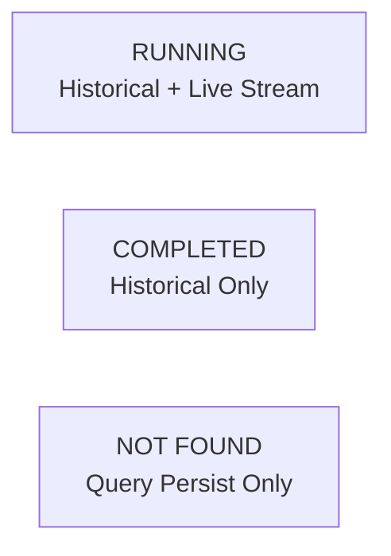
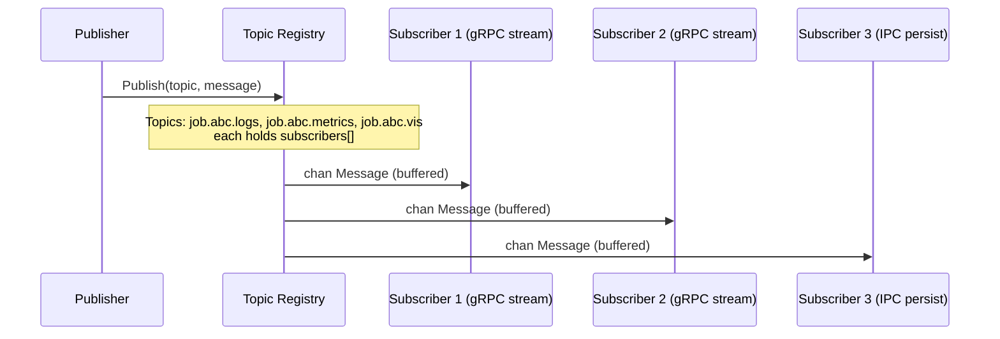
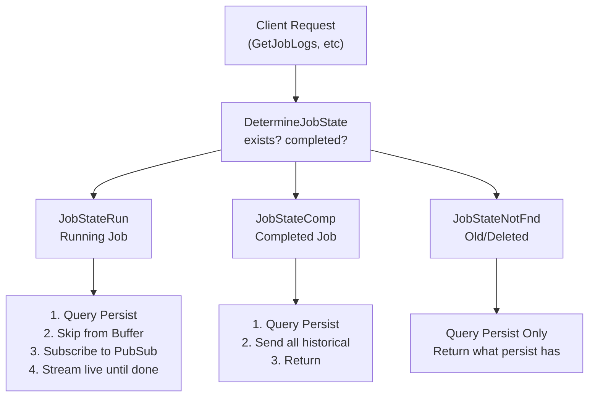
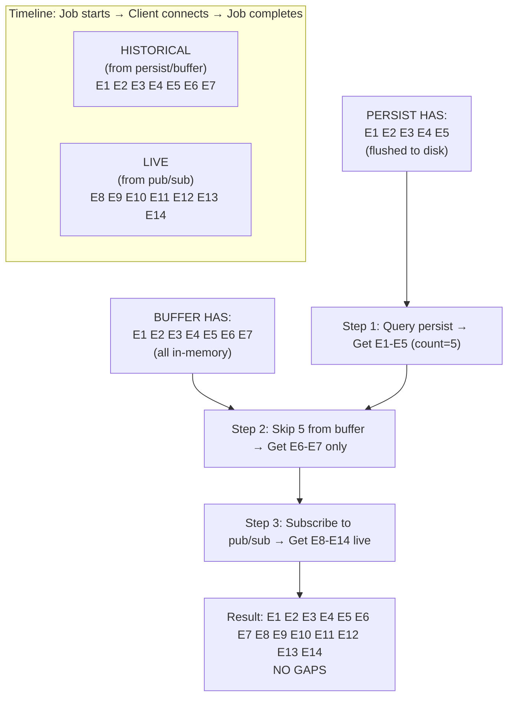
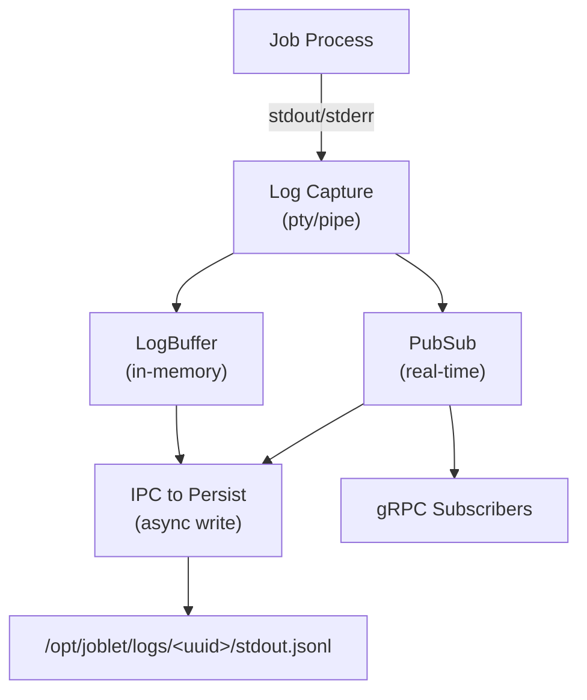
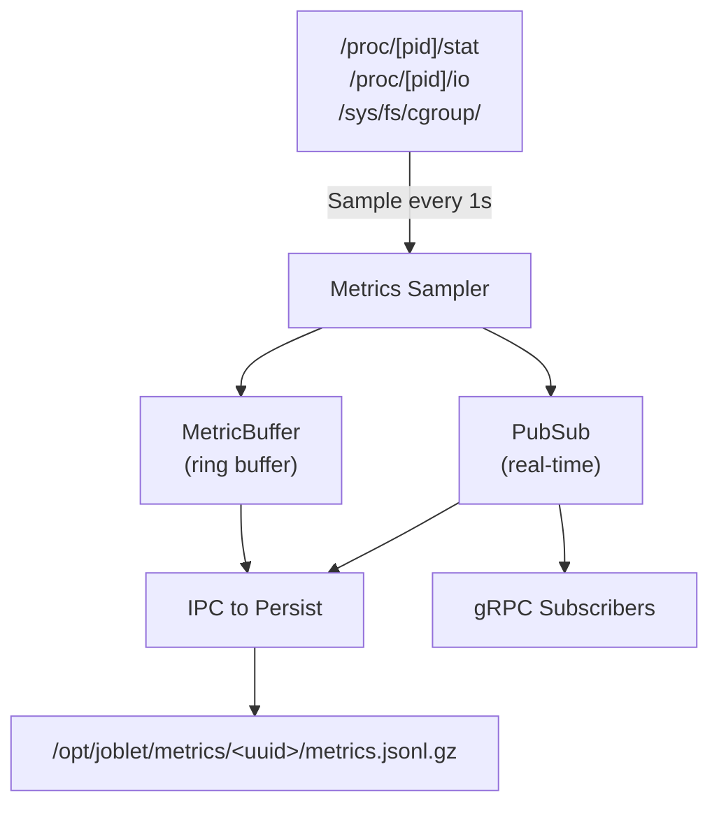
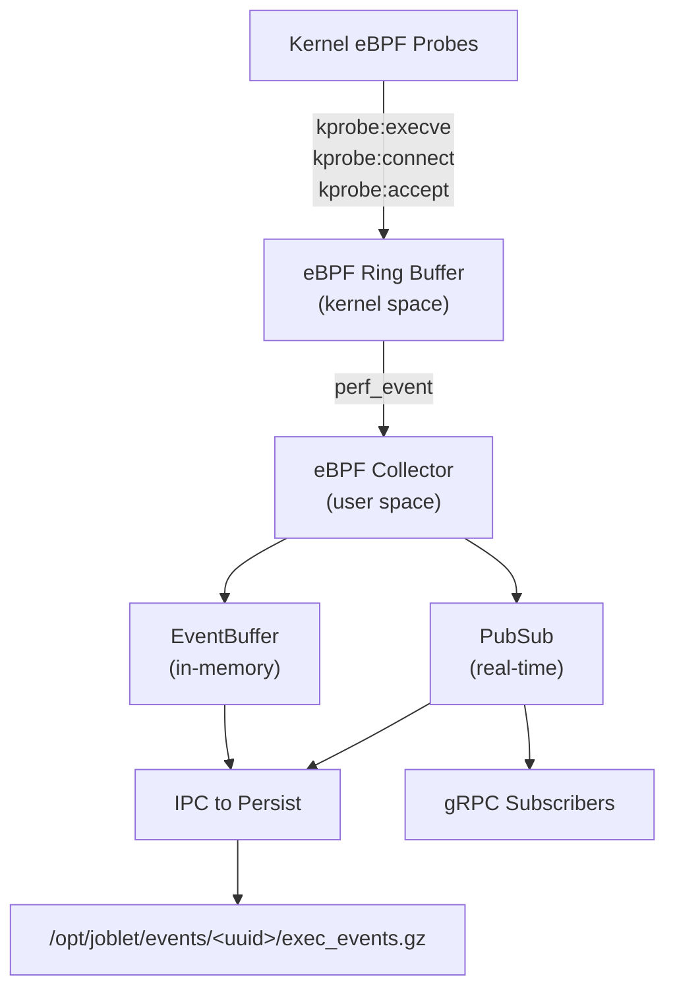

# Streaming Architecture: Pub/Sub and Historical Data

This document describes the unified streaming architecture used in Joblet for logs, metrics, and telematics events. The
design ensures gap-free data delivery during transitions between historical and live data.

## Table of Contents

1. [Overview](#overview)
2. [Architecture Diagrams](#architecture-diagrams)
3. [Components](#components)
4. [Data Flow](#data-flow)
5. [Gap Prevention Strategy](#gap-prevention-strategy)
6. [Implementation Details](#implementation-details)
7. [Storage Layout](#storage-layout)
8. [Testing](#testing)

---

## Overview

Joblet implements a unified "histogram" (historical + stream) pattern for three data types:

| Data Type      | Description                          | Storage Location       |
|----------------|--------------------------------------|------------------------|
| **Logs**       | Job stdout/stderr output             | `/opt/joblet/logs/`    |
| **Metrics**    | CPU, memory, I/O, network, GPU usage | `/opt/joblet/metrics/` |
| **Telematics** | eBPF security events (EXEC, CONNECT) | `/opt/joblet/events/`  |

The architecture handles three job states:



---

## Architecture Diagrams

### High-Level System Architecture

```mermaid
flowchart TD
    subgraph NODE["JOBLET NODE"]
        subgraph JEL["JOB EXECUTION LAYER"]
            J1["Job 1 (chroot)"]
            J2["Job 2 (chroot)"]
            J3["Job 3 (chroot)"]
            JN["Job N (chroot)"]
            subgraph DC["DATA COLLECTORS"]
                C1["stdout/err capture"]
                C2["procfs sampler"]
                C3["eBPF Probes (exec/net/file/mem)"]
            end
            J1 --> DC
            J2 --> DC
            J3 --> DC
            JN --> DC
        end
        subgraph BUF["IN-MEMORY BUFFER LAYER"]
            B1["LogBuffer (per job)"]
            B2["MetricBuffer (per job)"]
            B3["EventBuffer (per job)"]
            PSN["PUB/SUB SYSTEM (Generic[T any])<br/>Topics: job.{uuid}.logs, job.{uuid}.metrics, job.{uuid}.telematics"]
            B1 --> PSN
            B2 --> PSN
            B3 --> PSN
        end
        C1 --> B1
        C2 --> B2
        C3 --> B3
        IPC["IPC Client (to persist)<br/>Write logs, metrics, events to persist"]
        GRPC["gRPC Server (streaming)<br/>StreamLogs()<br/>StreamMetrics()<br/>StreamVisib()"]
        subgraph PERSIST["PERSIST SERVICE"]
            STORE["Local Storage<br/>/opt/joblet/logs/<br/>/opt/joblet/metrics/<br/>/opt/joblet/events/"]
        end
        PSN --> IPC
        PSN --> GRPC
        PSN --> PERSIST
        IPC --> PERSIST
    end
    CLI["RNX CLI<br/>rnx job log &lt;id&gt;<br/>rnx job metrics &lt;id&gt;<br/>rnx job telematics"]
    GRPC --> CLI
```



### Pub/Sub Message Flow



### Unified Streaming Pattern (StreamWithHistory)



### Gap Prevention During Persist → Live Transition



---

## Components

### 1. Pub/Sub System (`internal/joblet/pubsub/pubsub.go`)

Generic, type-safe in-memory publish-subscribe system using Go generics.

```go
type PubSub[T any] interface {
Publish(ctx context.Context, topic string, message T) error
Subscribe(ctx context.Context, topic string) (<-chan Message[T], func (), error)
Close() error
Health(ctx context.Context) error
}
```

**Key Features:**

- Type-safe with Go generics (`PubSub[LogEntry]`, `PubSub[MetricSample]`)
- Buffered channels prevent slow subscribers from blocking publishers
- Auto-cleanup on context cancellation
- Topic-level statistics tracking

### 2. Stream Helper (`internal/joblet/server/stream_helper.go`)

Implements the unified streaming pattern across all data types.

```go
type StreamConfig struct {
JobUUID          string
Logger           *logger.Logger
SendHistorical   func () (int, error) // Send persist + buffer data
QueryPersistOnly func () (int, error) // For completed/not-found jobs
StreamLive       func () error // Subscribe to pub/sub
}

func StreamWithHistory(ctx context.Context, cfg StreamConfig, state JobState) error
```

### 3. Log Buffer (`internal/joblet/adapters/log_buffer.go`)

In-memory buffer for recent log entries with skip support for gap prevention.

```go
type SimpleLogBuffer struct {
jobID string
data  [][]byte
mutex sync.RWMutex
}

// ReadAfterSkip returns data after skipping N items (already sent from persist)
func (b *SimpleLogBuffer) ReadAfterSkip(skipCount int) [][]byte
```

### 4. Persist Service (`persist/`)

Long-term storage service with gzip-compressed JSONL files.

```
/opt/joblet/
├── logs/
│   └── <job-uuid>/
│       └── stdout.jsonl
├── metrics/
│   └── <job-uuid>/
│       └── metrics.jsonl.gz
└── events/
    └── <job-uuid>/
        ├── exec_events.jsonl.gz
        ├── connect_events.jsonl.gz
        └── file_events.jsonl.gz
```

---

## Data Flow

### 1. Log Data Flow



### 2. Metrics Data Flow



### 3. Telematics (eBPF) Data Flow



---

## Gap Prevention Strategy

### The Problem

When a client connects mid-execution, there's a potential gap:

```
Time:     T0────T1────T2────T3────T4────T5────T6────T7────T8
Events:   E1    E2    E3    E4    E5    E6    E7    E8    E9
                            │
                      Client connects
                            │
Persist has: E1-E3          │
Buffer has:  E1-E5          │
Live starts:                └──► E6, E7, E8, E9

WITHOUT gap prevention: E1, E2, E3, E6, E7, E8, E9  (E4, E5 MISSING!)
```

### The Solution

The `ReadAfterSkip` pattern ensures no gaps:

```go
// Step 1: Query persist for historical data
persistCount, _ := queryPersist(jobID) // Returns E1, E2, E3 (count=3)

// Step 2: Get remaining from buffer, skipping what persist already sent
bufferData := buffer.ReadAfterSkip(persistCount) // Returns E4, E5

// Step 3: Subscribe to live stream
liveChannel := pubsub.Subscribe(topic) // Receives E6, E7, E8, E9

// Result: E1, E2, E3, E4, E5, E6, E7, E8, E9 (NO GAPS!)
```

### Deduplication

Some overlap may occur at the transition boundary. The system handles this by:

1. **PID-based dedup for telematics**: Same PID events are deduplicated
2. **Timestamp-based ordering**: Events are sorted chronologically
3. **Acceptable overlap**: Small duplicates are preferred over gaps

---

## Storage Layout

### Directory Structure

```
/opt/joblet/
├── logs/                          # Job log output
│   └── <job-uuid>/
│       └── stdout.jsonl           # Plain JSONL (fast writes)
│
├── metrics/                       # Resource usage metrics
│   └── <job-uuid>/
│       └── metrics.jsonl.gz       # Gzip-compressed JSONL
│
├── events/                        # eBPF telematics events
│   └── <job-uuid>/
│       ├── exec_events.jsonl.gz   # Process execution events
│       ├── connect_events.jsonl.gz # Network connection events
│       ├── accept_events.jsonl.gz  # Incoming connections
│       └── file_events.jsonl.gz    # File operation events
│
└── run/                           # Runtime sockets
    ├── persist-ipc.sock           # IPC for data writes
    └── persist-grpc.sock          # gRPC for data queries
```

### File Formats

**Logs (stdout.jsonl):**

```json
{
  "timestamp": "2025-01-01T00:00:01Z",
  "stream": "stdout",
  "data": "Hello World\n"
}
{
  "timestamp": "2025-01-01T00:00:02Z",
  "stream": "stderr",
  "data": "Error: ...\n"
}
```

**Metrics (metrics.jsonl.gz):**

```json
{
  "timestamp": 1704067201,
  "cpu_percent": 45.2,
  "memory_bytes": 1073741824,
  "io_read": 1024
}
{
  "timestamp": 1704067202,
  "cpu_percent": 52.1,
  "memory_bytes": 1073741824,
  "io_read": 2048
}
```

**Telematics Events (exec_events.jsonl.gz):**

```json
{
  "timestamp": 1704067201,
  "event": "EXEC",
  "pid": 12345,
  "ppid": 12344,
  "path": "/usr/bin/ls"
}
{
  "timestamp": 1704067202,
  "event": "EXEC",
  "pid": 12346,
  "ppid": 12345,
  "path": "/bin/cat"
}
```

---

## Testing

### E2E Gap Tests

| Test File                   | Data Type  | Description                                   |
|-----------------------------|------------|-----------------------------------------------|
| `11_metrics_gap_test.sh`    | Metrics    | Validates no gaps during metrics streaming    |
| `13_log_gap_live_test.sh`   | Logs       | Validates no gaps during log streaming        |
| `17_telematics_gap_test.sh` | Telematics | Validates no gaps during eBPF event streaming |

### Running Gap Tests

```bash
# Run all gap tests
./tests/e2e/tests/11_metrics_gap_test.sh
./tests/e2e/tests/13_log_gap_live_test.sh
./tests/e2e/tests/17_telematics_gap_test.sh

# Or run full e2e suite
./tests/e2e/run_tests.sh
```

### Test Scenarios

1. **Live Streaming (Mid-execution)**: Start job, wait N seconds, connect client, verify all events received
2. **Early Check**: Start job, connect client within 1 second, verify streaming works
3. **Completed Job**: Wait for job completion, verify historical retrieval from persist
4. **Gap Detection**: Validate persist → live transition has no missing events
5. **Deduplication**: Verify acceptable duplicate count during transitions

---

## Configuration

### Persist Configuration (`joblet-config.yml`)

```yaml
persist:
  storage:
    type: local
    local:
      logs:
        directory: /opt/joblet/logs
      metrics:
        directory: /opt/joblet/metrics
      events:
        directory: /opt/joblet/events
```

### Pub/Sub Configuration

```yaml
pubsub:
  buffer_size: 100  # Messages per subscriber channel
```

---

## Related Documentation

- [PERSISTENCE.md](PERSISTENCE.md) - Persist service architecture
- [MONITORING.md](MONITORING.md) - Metrics collection and monitoring
- [JOB_EXECUTION.md](JOB_EXECUTION.md) - Job lifecycle management
- [API.md](API.md) - gRPC API reference
