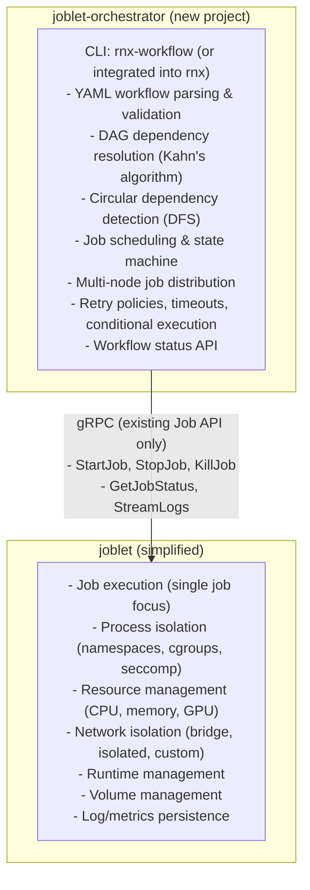

# ADR-013: Extract Workflow Orchestration to Separate Project

## Status

**Implemented** (December 2025)

The workflow code has been removed from joblet. Joblet now focuses exclusively on single-job execution. Workflow
orchestration will be developed as a separate project that uses joblet's Job API for execution.

### Implementation Completed

The following changes were made to implement this decision:

**Code Removal (Complete):**

- Removed `WorkflowUuid` and `Dependencies` fields from `internal/joblet/domain/job.go`
- Removed `WorkflowUuid` and `Dependencies` from `internal/joblet/core/interfaces/requests.go`
- Removed workflow fields from `internal/joblet/core/job/builder.go`
- Removed workflow fields from `internal/joblet/core/joblet.go`
- Removed workflow fields from `internal/joblet/server/job_service.go` response
- Removed workflow serialization from `state/internal/storage/dynamodb.go`
- Removed workflow display from `internal/rnx/jobs/status.go`
- Removed `JOBLET_WORKFLOW_ID` from reserved environment variables
- Updated test files to remove workflow-specific references

**Documentation Updates:**

- Removed `docs/WORKFLOWS.md`
- Removed `docs/adr/002-workflow-vs-job-separation.md` (superseded by this ADR)
- Updated `docs/README.md`, `docs/API.md`, `docs/ARCHITECTURE.md`
- Updated `docs/DEVELOPER_GUIDE.md`, `docs/JOB_EXECUTION.md`, `docs/DESIGN.md`
- Updated `docs/INSTALLATION.md`, `docs/QUICKSTART.md`, `docs/NETWORK_MANAGEMENT.md`
- Updated `docs/ADMIN_UI.md`, `docs/articles/getting-start-with-joblet.md`
- Updated `docs/DEPRECATION.md`, `docs/ENVIRONMENT_VARIABLES.md`, `docs/GPU_TESTING.md`
- Updated `docs/adr/README.md` to remove workflow ADR reference

**Test Updates:**

- Removed `tests/e2e/tests/06_workflow_test.sh` (obsolete E2E test)
- Updated `state/internal/storage/dynamodb_test.go` to remove workflow assertions
- All remaining E2E tests pass

**Proto Compatibility:**

- Proto definitions in external `joblet-proto` repository remain unchanged
- Joblet ignores workflow fields from proto but does not send them in responses

## Context

Joblet currently bundles workflow orchestration directly into the main codebase. While ADR-002 established separation
between workflow and job service layers, both still live within the same binary and repository. This coupling has
become a constraint as the project evolves.

The workflow orchestration code includes:

- **Server-side**: `internal/joblet/workflow/` - DAG resolution, dependency tracking, orchestration loop
- **Client-side**: `internal/rnx/workflows/` - YAML parsing, validation, file extraction
- **gRPC service**: `internal/joblet/server/workflow_service.go`
- **Proto definitions**: Workflow-specific messages in `joblet-proto`

Several forces are pushing us toward extraction:

1. **Complexity creep**: Workflow orchestration adds significant complexity to the joblet codebase. Users who only need
   simple job execution must still carry this weight.

2. **Different scaling patterns**: Job execution benefits from running close to compute resources. Workflow
   orchestration is stateful coordination that could run centrally or distributed differently.

3. **Independent evolution**: Workflow features (retry policies, conditional branching, timeouts, UI) evolve at a
   different pace than core job execution. Coupling them slows both down.

4. **Deployment flexibility**: Some users want joblet as a lightweight job executor without workflow overhead. Others
   want sophisticated orchestration. Currently, everyone gets both.

5. **Orchestration flexibility**: Some users want to drive joblet from their own orchestration layer while using
   joblet purely for execution. The current coupling makes this awkward.

## Decision

Extract workflow orchestration into a separate project (`joblet-orchestrator`) that communicates with joblet purely
through the existing gRPC Job API.

### New Architecture



### What Gets Removed from Joblet

```text
internal/joblet/workflow/              # Orchestration engine
├── manager.go
├── dependency_resolver.go
├── expression_evaluator.go
└── types/

internal/rnx/workflow/                 # CLI workflow commands
internal/rnx/workflows/                # YAML parsing
├── config.go
├── parser.go
├── validator.go
└── dependency_graph.go

internal/joblet/server/workflow_service.go   # gRPC service

tests/workflow/                        # Workflow tests
docs/WORKFLOWS.md                      # Moves to new project
```

### What Stays in Joblet

```text
internal/joblet/server/job_service.go        # Core job API
internal/joblet/server/runtime_service.go    # Runtime management
internal/joblet/server/volume_service.go     # Volume management
internal/joblet/server/network_service.go    # Network management
internal/joblet/server/monitoring_service.go # Metrics/monitoring

internal/joblet/core/                        # Job execution
├── execution/
├── process/
├── filesystem/
├── resource/
└── ...

internal/rnx/jobs/                           # Job CLI commands
```

### New Project Structure

```text
joblet-orchestrator/
├── cmd/
│   └── orchestrator/main.go
├── internal/
│   ├── workflow/
│   │   ├── manager.go           # Moved from joblet
│   │   ├── dependency.go        # Moved from joblet
│   │   └── state.go
│   ├── parser/
│   │   ├── yaml.go              # Moved from joblet
│   │   └── validator.go
│   ├── scheduler/
│   │   ├── scheduler.go         # New: multi-node scheduling
│   │   └── strategy.go
│   └── client/
│       └── joblet_client.go     # gRPC client wrapper
├── api/
│   └── orchestrator.proto       # Workflow-specific API
└── go.mod                       # Depends on joblet-proto
```

### Migration Path

1. **Phase 1**: Create `joblet-orchestrator` project with workflow code copied (not moved)
2. **Phase 2**: Add deprecation warnings to joblet workflow commands
3. **Phase 3**: Remove workflow code from joblet in next major version
4. **Phase 4**: Update documentation and migration guides

## Consequences

### The Good

**Simpler joblet**: The core project becomes focused and easier to understand. New contributors can grasp job
execution without workflow complexity. The binary is smaller, startup is faster.

**Independent releases**: Workflow features can ship without touching joblet. Bug fixes in orchestration don't
require joblet updates. Version coupling is eliminated.

**Deployment flexibility**: Run orchestrator centrally while distributing joblet agents. Or run both together.
Or skip orchestrator entirely for simple use cases.

**Universal executor**: With orchestration decoupled, joblet becomes a universal job executor that any
orchestration layer can drive through its gRPC Job API.

**Better testing**: Each project has focused test suites. Workflow integration tests use the real gRPC API,
catching interface issues early.

**New capabilities**: The orchestrator can add features that don't belong in joblet:

- Web UI for workflow visualization
- Multi-cluster job distribution
- Advanced retry policies with backoff
- Conditional branching and loops
- Workflow versioning and rollback
- Audit logging and compliance

### The Trade-offs

**Network overhead**: Workflow-to-job communication goes over gRPC instead of in-process calls. For workflows with
many small jobs, this adds latency. Mitigation: batch operations, connection pooling.

**Operational complexity**: Two services to deploy instead of one. More configuration, more things that can fail.
Mitigation: Provide compose/helm templates, single-binary mode option.

**State synchronization**: Orchestrator needs to handle joblet restarts, network partitions, and job status
reconciliation. This is new complexity. Mitigation: Design for idempotency, implement health checks.

**User migration**: Existing workflow users need to adopt the new tool. Mitigation: Maintain backward-compatible
YAML format, provide migration scripts.

### What This Enables

**Multi-node workflows**: Orchestrator can schedule jobs across multiple joblet instances, enabling:

- Job affinity/anti-affinity
- Resource-aware scheduling
- Geographic distribution
- Failure domain isolation

**Unified execution backend**: The orchestrator targets joblet as its execution backend everywhere: local,
cloud, and multi-node. Because joblet provides isolation, resource limits, GPU allocation, and networking natively
through Linux kernel primitives, the orchestrator gets one consistent execution surface across environments without
having to special-case container runtimes or remote-shell transports.

**Workflow-as-Code**: Without being tied to joblet's release cycle, the orchestrator can experiment with:

- Go SDK for programmatic workflows
- Python DSL
- TypeScript support

## Alternatives Considered

### Keep Workflows in Joblet

Continue current architecture. Lowest effort but doesn't address the coupling concerns. Workflow complexity
continues to grow inside joblet.

**Rejected because**: The forces driving extraction will only strengthen over time. Better to separate now while
the codebase is manageable.

### Embed Orchestrator as Optional Plugin

Build orchestrator as a plugin loaded at runtime. Single binary, optional capability.

**Rejected because**: Go's plugin system is limited and brittle. Versioning plugins with the host is complex.
Doesn't help with independent deployment.

### Adopt a Third-Party Orchestrator

Don't build our own orchestrator. Document how to drive joblet from an off-the-shelf one instead.

**Rejected**: A first-party orchestrator that speaks joblet's Job API natively gives users a cohesive, supported
experience out of the box. Extracting workflows into `joblet-orchestrator` still keeps the Job API open, so teams
with an existing orchestration layer can integrate, but joblet ships a complete solution rather than deferring to
external tooling.

## Implementation Notes

### Proto Changes

The `joblet-proto` workflow messages can either:

1. Move to a new `orchestrator-proto` repository
2. Stay in `joblet-proto` but be consumed only by orchestrator

Option 2 is simpler for migration. The Job API messages stay unchanged.

### CLI Integration

Two options for the CLI:

1. **Separate binary**: `rnx-workflow` for workflows, `rnx` for jobs
2. **Unified with subcommand**: `rnx workflow run` calls orchestrator, `rnx job run` calls joblet

Option 2 provides better UX but requires CLI to know about both services.

### Backward Compatibility

During migration, joblet can proxy workflow requests to the orchestrator, maintaining API compatibility for
existing clients.

## References

- This ADR supersedes ADR-002 (Workflow vs Job Separation), which has been removed as workflow functionality no longer
  exists in joblet
