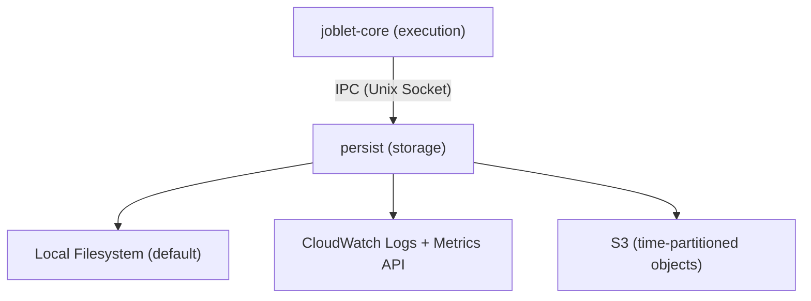

# Joblet Persist

Dedicated persistence service for the Joblet job execution platform. Handles all log, metrics, and eBPF telemetry
storage, queries, and lifecycle management.

## Overview

`persist` is a separate service that receives logs, metrics, and eBPF events from `joblet-core` via Unix domain
sockets (IPC) and provides:

- **Persistent storage** - Local filesystem, CloudWatch Logs, and S3 backends
- **eBPF Event Storage** - All eBPF telemetry events (exec, connect, file, accept, socket_data, mmap, mprotect)
- **Historical queries** - gRPC API for querying stored logs, metrics, and events
- **Data lifecycle** - Retention policies, cleanup, compression, and rotation
- **Multiple backends** - Pluggable storage architecture with consistent interface

## Architecture



## Features

### v1.0 (Current)

- ✅ IPC server for receiving logs/metrics from joblet-core
- ✅ Local filesystem storage with compression
- ✅ File rotation and retention policies
- ✅ Job index for fast lookups
- ✅ gRPC API for historical queries
- ✅ Batch writing for performance

### v1.1 (Current)

- ✅ **CloudWatch Logs integration** - Ship logs, metrics, and eBPF events to CloudWatch
- ✅ **eBPF event storage** - All eBPF telemetry events (exec, connect, file, accept, socket_data, mmap, mprotect)
- ✅ Multi-backend support (local + CloudWatch)

### v2.0 (Current)

- ✅ **S3 storage backend** - Cost-effective storage with time-partitioned keys
- ✅ Configurable flush intervals and buffer thresholds
- ✅ Server-side encryption support (AES256, KMS)

### v3.0 (Planned)

- [ ] Advanced querying (full-text search, time-range aggregation)
- [ ] Cross-region replication
- [ ] Real-time streaming to external systems

## Building

```bash
go build -o bin/persist ./cmd/persist
```

## Configuration

See `config.example.yml` for a complete configuration example.

Key configuration sections:

- **server** - gRPC server settings
- **ipc** - Unix socket configuration
- **storage** - Backend configuration (local/cloudwatch/s3)
- **writer** - Write pipeline tuning
- **query** - Query engine settings
- **monitoring** - Prometheus and health endpoints

## Running

```bash
# With default config
./bin/persist

# With custom config
./bin/persist -config /path/to/config.yml
```

## API

### gRPC Services

**PersistService** (port 50052 by default):

- `QueryLogs` - Stream logs for a job
- `QueryMetrics` - Stream metrics for a job
- `GetJobInfo` - Get job metadata
- `ListJobs` - List jobs with filters
- `DeleteJob` - Delete job data
- `GetStats` - Get service statistics
- `CleanupOldData` - Run retention cleanup

### IPC Protocol

Messages received from joblet-core via Unix socket at `/opt/joblet/run/persist.sock`:

- Protocol: Length-prefixed Protobuf
- Message types: Logs, Metrics, and all eBPF telemetry events
- Format: `[4-byte length][protobuf message]`

**Message Types:**

| Type                             | Description                                 |
|----------------------------------|---------------------------------------------|
| `MESSAGE_TYPE_LOG`               | Job stdout/stderr log lines                 |
| `MESSAGE_TYPE_METRIC`            | Resource metrics (CPU, memory, GPU, I/O)    |
| `MESSAGE_TYPE_EXEC_EVENT`        | Process execution events (from eBPF)        |
| `MESSAGE_TYPE_CONNECT_EVENT`     | Network connection events (from eBPF)       |
| `MESSAGE_TYPE_FILE_EVENT`        | File access events (from eBPF)              |
| `MESSAGE_TYPE_ACCEPT_EVENT`      | Socket accept events (from eBPF)            |
| `MESSAGE_TYPE_SOCKET_DATA_EVENT` | Socket data transfer events (from eBPF)     |
| `MESSAGE_TYPE_MMAP_EVENT`        | Memory mapping events (from eBPF)           |
| `MESSAGE_TYPE_MPROTECT_EVENT`    | Memory protection change events (from eBPF) |

## Storage Layout

### Local Backend

```
/opt/joblet/
├── logs/
│   └── <job-uuid>/
│       ├── stdout.log.gz
│       └── stderr.log.gz
├── metrics/
│   └── <job-uuid>/
│       └── metrics.jsonl.gz
├── events/
│   └── <job-uuid>/
│       ├── exec_events.jsonl.gz         # eBPF process execution events
│       ├── connect_events.jsonl.gz      # eBPF network connection events
│       ├── file_events.jsonl.gz         # eBPF file access events
│       ├── accept_events.jsonl.gz       # eBPF socket accept events
│       ├── socket_data_events.jsonl.gz  # eBPF socket data events
│       ├── mmap_events.jsonl.gz         # eBPF memory mapping events
│       └── mprotect_events.jsonl.gz     # eBPF memory protection events
└── job_index.json
```

### CloudWatch Backend

```
CloudWatch Logs:
  Log Group: /joblet/{node_id}
  Log Streams per job:
    - {job_uuid}-logs                 # stdout/stderr logs
    - {job_uuid}-metrics              # Resource metrics (JSON)
    - {job_uuid}-exec-events          # Process execution events (JSON)
    - {job_uuid}-connect-events       # Network connection events (JSON)
    - {job_uuid}-file-events          # File access events (JSON)
    - {job_uuid}-accept-events        # Socket accept events (JSON)
    - {job_uuid}-socket-data-events   # Socket data events (JSON)
    - {job_uuid}-mmap-events          # Memory mapping events (JSON)
    - {job_uuid}-mprotect-events      # Memory protection events (JSON)
```

### S3 Backend

The S3 backend uses **time-partitioned keys** to avoid expensive read-modify-write operations. Each flush creates a new object with a nanosecond timestamp, enabling efficient append-only writes.

**Storage Layout:**

```
s3://{bucket}/{key_prefix}{node_id}/{job_uuid}/
  stdout/
    1704345600000000000.jsonl.gz    # First flush
    1704345630000000000.jsonl.gz    # Second flush (30s later)
    1704345660000000000.jsonl.gz    # Third flush
  stderr/
    1704345615000000000.jsonl.gz
  metrics/
    1704345600000000000.jsonl.gz
  exec-events/
    1704345600000000000.jsonl.gz
  connect-events/
    1704345600000000000.jsonl.gz
  file-events/
    1704345600000000000.jsonl.gz
  accept-events/
    1704345600000000000.jsonl.gz
  socket-data-events/
    1704345600000000000.jsonl.gz
  mmap-events/
    1704345600000000000.jsonl.gz
  mprotect-events/
    1704345600000000000.jsonl.gz
```

**Configuration:**

```yaml
storage:
  type: s3
  s3:
    region: us-east-1              # Required: AWS region
    bucket: my-joblet-data         # Required: S3 bucket name
    key_prefix: jobs/              # Optional: Object key prefix (default: "jobs/")

    # Buffering settings
    flush_interval: 30             # Seconds between flushes (default: 30)
    flush_threshold: 5242880       # Bytes before flush (default: 5MB)
    max_buffer_size: 52428800      # Max buffer before blocking (default: 50MB)

    # S3-specific options
    storage_class: STANDARD        # S3 storage class (default: STANDARD)
    sse: AES256                    # Server-side encryption: "", "AES256", or "aws:kms"
    kms_key_id: ""                 # KMS key ID if sse="aws:kms"
```

**Authentication:** Uses AWS default credential chain (IAM roles, instance profiles, environment variables).

**Cost Comparison:**

| Backend    | Ingestion Cost | Storage Cost | Query Cost       |
|------------|----------------|--------------|------------------|
| CloudWatch | ~$0.50/GB      | ~$0.03/GB/mo | CloudWatch Logs  |
| S3         | Free           | ~$0.023/GB/mo| Application-side |

**When to use S3:**
- Long-term archival (cheaper than CloudWatch)
- High-volume telemetry data
- Custom query requirements (Athena, Spark)
- Cross-region data access

## Monitoring

- **Prometheus metrics**: `http://localhost:9092/metrics`
- **Health check**: `http://localhost:9093/health`

Key metrics:

- `persist_ipc_messages_received_total`
- `persist_write_latency_seconds`
- `persist_storage_bytes_total`
- `persist_query_requests_total`

## Development

### Project Structure

```
persist/
├── cmd/
│   └── persist/           # Main entry point
├── internal/
│   ├── config/            # Configuration
│   ├── ipc/               # IPC server
│   ├── storage/           # Storage backends
│   │   ├── backend.go     # Interface & factory
│   │   ├── local.go       # Local filesystem backend
│   │   ├── cloudwatch.go  # AWS CloudWatch backend
│   │   ├── s3.go          # AWS S3 backend
│   │   └── index.go       # Job index
│   └── server/            # gRPC server
└── pkg/
    └── logger/            # Logging
```

### Adding a New Storage Backend

1. Implement the `storage.Backend` interface
2. Add configuration in `config/config.go`
3. Register in `storage.NewBackend()`

Example:

```go
type MyBackend struct { ... }

func (b *MyBackend) WriteLogs(jobID string, logs []*ipcpb.LogLine) error { ... }
func (b *MyBackend) WriteMetrics(jobID string, metrics []*ipcpb.Metric) error { ... }
func (b *MyBackend) WriteExecEvents(jobID string, events []*ipcpb.ExecEvent) error { ... }
func (b *MyBackend) WriteConnectEvents(jobID string, events []*ipcpb.ConnectEvent) error { ... }
func (b *MyBackend) WriteFileEvents(jobID string, events []*ipcpb.FileEvent) error { ... }
func (b *MyBackend) WriteAcceptEvents(jobID string, events []*ipcpb.AcceptEvent) error { ... }
func (b *MyBackend) WriteSocketDataEvents(jobID string, events []*ipcpb.SocketDataEvent) error { ... }
func (b *MyBackend) WriteMmapEvents(jobID string, events []*ipcpb.MmapEvent) error { ... }
func (b *MyBackend) WriteMprotectEvents(jobID string, events []*ipcpb.MprotectEvent) error { ... }
// ... implement Read* and other interface methods
```

## License

Same as joblet-core

## Related Projects

- [joblet](https://github.com/ehsaniara/joblet) - Core job execution engine
- [joblet-proto](https://github.com/ehsaniara/joblet-proto) - Protobuf definitions
- [joblet-sdk-python](https://github.com/ehsaniara/joblet-sdk-python) - Python SDK
- [joblet-admin](https://github.com/ehsaniara/joblet-admin) - Admin UI
- [joblet-mcp-server](https://github.com/ehsaniara/joblet-mcp-server) - MCP Server
